# 人工智能实验报告——深度学习

姓名:陶昕璨  学号:24325242

# 一.实验题目

#### 中药图片分类任务

利用pytorch框架搭建神经网络实现中药图片分类，其中中药图片数据分为训练集`train`和测试集`test`，训练集仅用于网络训练阶段，测试集**仅用于模型的性能测试阶段**。训练集和测试集均包含五种不同类型的中药图片：`baihe`、`dangshen`、`gouqi`、`huaihua`、`jinyinhua`。请合理设计神经网络架构，利用训练集完成网络训练，统计网络模型的训练准确率和测试准确率，画出模型的训练过程的loss曲线、准确率曲线。

---

# 二、实验内容

## 1. 算法原理

### 1.1 卷积神经网络（CNN）

本实验采用卷积神经网络（Convolutional Neural Network，CNN）完成五类中药图片分类任务

CNN 通过卷积运算能够有效提取图像中的局部纹理、边缘信息以及高级语义特征，更适用于中药图片分类任务。

**网络主要由卷积层、批归一化层、激活函数层、池化层和全连接层组成**

代码支持CPU运行和GPU运行

---

### 1.2 卷积层

卷积层利用多个卷积核对输入图像进行**特征提取**，其计算过程如下：

$$
y(i,j)=\sum_m\sum_n x(i+m,j+n)w(m,n)+b
$$

其中：

* (x) 表示输入特征图；
* (w) 表示卷积核参数；
* (b) 表示偏置项；
* (y) 表示输出特征图。

卷积层能够提取图像中的边缘、纹理以及局部结构特征。

---

### 1.3 Batch Normalization

为了**加快网络收敛速度并提高训练稳定性**，在每个卷积层后加入 Batch Normalization（BN）层。

BN 的计算过程为：

$$
\hat{x}=\frac{x-\mu}{\sqrt{\sigma^2+\epsilon}}
$$

其中：

* $(\mu)$ 为当前批次均值；
* $(\sigma^2)$ 为当前批次方差；
* $(\epsilon)$ 为防止分母为零的极小值。

Batch Normalization 能够缓解梯度消失问题，提高模型泛化能力。

---

### 1.4 ReLU激活函数

网络采用 ReLU（Rectified Linear Unit）作为激活函数：

$$
f(x)=\max(0,x)
$$

相比 Sigmoid 和 Tanh 函数，ReLU 计算简单且能够缓解梯度消失问题，从而提高训练效率。

---

### 1.5 最大池化层

为了**减少特征图尺寸和模型参数量**，引入最大池化层（Max Pooling）：

$$
y=\max(x)
$$

池化层能够保留最显著特征，同时降低计算复杂度，提高模型的抗噪声能力。

---

### 1.6 Dropout正则化

为了**降低过拟合风险**，在分类器部分加入 Dropout：

$$
y=
\begin{cases}
0,&p\\
\frac{x}{1-p},&1-p
\end{cases}
$$

训练阶段随机屏蔽部分神经元，从而提高网络泛化能力。

---

### 1.7 Softmax分类器

网络最后采用 Softmax 函数输出五个类别的概率：

$$
P(y=i)=
\frac{e^{z_i}}
{\sum_{j=1}^{5}e^{z_j}}
$$

最终选择概率最大的类别作为预测结果。

---

### 1.8 损失函数

本实验采用交叉熵损失函数（Cross Entropy Loss）：

$$
L=
-\sum_{i=1}^{N}
y_i\log(\hat y_i)
$$

其中：

* $(y_i)$ 为真实标签；
* $(\hat y_i)$ 为预测概率。

交叉熵能够有效衡量预测结果与真实标签之间的差异。

---

### 1.9 优化器

采用 AdamW 优化器进行参数更新：

$$
\theta_{t+1}=
\theta_t
-\eta
\frac{m_t}
{\sqrt{v_t}+\epsilon}
$$

其中：

* $(\eta)$ 为学习率；
* $(m_t)$ 为一阶矩估计；
* $(v_t)$ 为二阶矩估计。

AdamW 相比传统 SGD 收敛速度更快，对超参数敏感度较低。

---

### 1.10 网络结构设计

本实验设计的卷积神经网络结构如下：

| 层名称                    | 输出通道数 | 输出尺寸    |
| ---------------------- | ----- | ------- |
| Input                  | 3     | 160×160 |
| Conv3×3 + BN + ReLU    | 32    | 160×160 |
| Conv3×3 + BN + ReLU    | 32    | 160×160 |
| MaxPool                | 32    | 80×80   |
| Conv3×3 + BN + ReLU    | 64    | 80×80   |
| Conv3×3 + BN + ReLU    | 64    | 80×80   |
| MaxPool                | 64    | 40×40   |
| Conv3×3 + BN + ReLU    | 128   | 40×40   |
| Conv3×3 + BN + ReLU    | 128   | 40×40   |
| MaxPool                | 128   | 20×20   |
| Conv3×3 + BN + ReLU    | 256   | 20×20   |
| Conv3×3 + BN + ReLU    | 256   | 20×20   |
| MaxPool                | 256   | 10×10   |
| Global Average Pooling | 256   | 1×1     |
| FC(全连接层)                     | 128   | -       |
| FC                     | 5     | -       |

---

## 2. 关键代码展示

### 2.1 数据增强

为了提高模型泛化能力，对训练集进行随机增强处理。而测试机为了保证测试结果稳定不使用随机增强

```python
train_tfms = transforms.Compose([
        transforms.Resize((img_size + 32, img_size + 32)),
        transforms.RandomResizedCrop(img_size, scale=(0.75, 1.0)),
        transforms.RandomHorizontalFlip(p=0.5),
        transforms.RandomRotation(degrees=15),
        transforms.ColorJitter(
            brightness=0.2,
            contrast=0.2,
            saturation=0.2
        ),
        transforms.ToTensor(),
        transforms.Normalize(
            mean=[0.485, 0.456, 0.406], # ImageNet 数据集的百万张图片的统计值
            std=[0.229, 0.224, 0.225]
        )
    ])

    test_tfms = transforms.Compose([
        transforms.Resize((img_size, img_size)),
        transforms.ToTensor(),
        transforms.Normalize(
            mean=[0.485, 0.456, 0.406],
            std=[0.229, 0.224, 0.225]
        )
    ])

    return train_tfms, test_tfms
```

数据增强能够模拟不同拍摄环境下的图像变化，提高模型鲁棒性。

---

### 2.2 网络结构定义

`CNN` 基础模块 `ConvBNReLU`
- 卷积层 `Conv2d`
- 批归一化 `BatchNorm2d`
- 激活函数 `ReLU`

```python
class ConvBNReLU(nn.Module):
    def __init__(self, in_channels, out_channels, stride=1):
        super().__init__()
        self.block = nn.Sequential(
            nn.Conv2d(  # 卷积提取特征
                in_channels,
                out_channels,
                kernel_size=3,
                stride=stride,
                padding=1,
                bias=False # 批归一化抵消偏置
            ),
            nn.BatchNorm2d(out_channels), # 批归一化：标准正态分布，训练更稳定
            nn.ReLU(inplace=True) # 增强非线性能力
        )

    def forward(self, x):
        return self.block(x)
```

`HerbCNN` 分类模型

```python
class HerbCNN(nn.Module):
    """
    特征提取+分类器
    """

    def __init__(self, num_classes=5, dropout=0.35):
        super().__init__()

        # 空间尺寸减小，特征通道数增多
        # 得到形如[batch_size, 256, 10, 10] 的四维张量
        self.features = nn.Sequential(
            ConvBNReLU(3, 32),
            ConvBNReLU(32, 32),
            nn.MaxPool2d(2),   # 160 -> 80

            ConvBNReLU(32, 64),
            ConvBNReLU(64, 64),
            nn.MaxPool2d(2),   # 80 -> 40

            ConvBNReLU(64, 128),
            ConvBNReLU(128, 128),
            nn.MaxPool2d(2),   # 40 -> 20

            ConvBNReLU(128, 256),
            ConvBNReLU(256, 256),
            nn.MaxPool2d(2),   # 20 -> 10
        )

        self.classifier = nn.Sequential(
            nn.AdaptiveAvgPool2d((1, 1)), # 全局平均池化 -> [batch_size, 256, 1, 1]
            nn.Flatten(), # 一维向量 -> [batch_size, 256],便于全连接层接受
            nn.Dropout(dropout), # 随机丢弃 35% 的神经元防止过拟合
            nn.Linear(256, 128), # 全连接层：从 256 降维到 128
            nn.ReLU(inplace=True), 
            nn.Dropout(dropout),
            nn.Linear(128, num_classes) # 最后一层全连接：输出 5 个类别的得分
        )

    def forward(self, x):
        x = self.features(x)
        x = self.classifier(x)
        return x
```

网络采用逐层增加通道数的方法，提高特征表达能力。

---

### 2.3 模型训练

训练函数
```python
def train_one_epoch(model, loader, criterion, optimizer, device, scaler=None):
    model.train() # 调到训练模式

    total_loss = 0.0
    total_correct = 0
    total_samples = 0

    for images, labels in loader:
        images = images.to(device, non_blocking=True)
        labels = labels.to(device, non_blocking=True)

        optimizer.zero_grad() # 清空梯度

        # AMP 自动混合精度分支
        if scaler is not None: # NVIDIA 显卡+use_amp=True
            with torch.cuda.amp.autocast():
                outputs = model(images)
                loss = criterion(outputs, labels)

            scaler.scale(loss).backward() # 防止下溢出，放大loss
            scaler.step(optimizer) # 把放大后的梯度缩回正常比例
            scaler.update()
        else: # Intel 核显/ CPU 
            outputs = model(images)
            loss = criterion(outputs, labels)
            loss.backward()
            optimizer.step()

        correct, total = accuracy_from_logits(outputs, labels)

        total_loss += loss.item() * images.size(0)
        total_correct += correct
        total_samples += total

    avg_loss = total_loss / total_samples
    acc = total_correct / total_samples

    return avg_loss, acc


def train_model(model, train_loader, criterion, optimizer, scheduler, device, cfg):
    history = {
        "train_loss": [],
        "train_acc": [],
        "lr": []
    }

    best_model_wts = copy.deepcopy(model.state_dict())
    best_train_acc = 0.0

    start_time = time.time()

    scaler = None
    if device.type == "cuda" and cfg.use_amp:
        scaler = torch.cuda.amp.GradScaler()

    for epoch in range(cfg.epochs):
        epoch_start = time.time()

        train_loss, train_acc = train_one_epoch(
            model=model,
            loader=train_loader,
            criterion=criterion,
            optimizer=optimizer,
            device=device,
            scaler=scaler
        )

        scheduler.step() # 动态学习率调整

        current_lr = optimizer.param_groups[0]["lr"]

        history["train_loss"].append(train_loss)
        history["train_acc"].append(train_acc)
        history["lr"].append(current_lr)

        if train_acc > best_train_acc:
            best_train_acc = train_acc
            best_model_wts = copy.deepcopy(model.state_dict())

        epoch_time = time.time() - epoch_start

        print(
            f"Epoch [{epoch + 1:03d}/{cfg.epochs}] "
            f"Loss: {train_loss:.4f} | "
            f"Train Acc: {train_acc:.4f} | "
            f"LR: {current_lr:.6f} | "
            f"Time: {epoch_time:.2f}s"
        )

    total_time = time.time() - start_time

    model.load_state_dict(best_model_wts)

    return model, history, total_time
```

```python
criterion = nn.CrossEntropyLoss()

optimizer = optim.AdamW(
    model.parameters(),
    lr=1e-3,
    weight_decay=1e-4
)

scheduler = optim.lr_scheduler.CosineAnnealingLR(
    optimizer,
    T_max=epochs
)
```

训练过程中采用 AdamW 优化器和余弦退火学习率策略。

---

### 2.4 模型性能评估

```python
def count_parameters(model):
    return sum(p.numel() for p in model.parameters() if p.requires_grad)


def get_model_size_mb(model_path):
    size_bytes = os.path.getsize(model_path)
    return size_bytes / 1024 / 1024 # 转MB

# 推理速度：总推理时间，每张图片耗时，FP5
@torch.no_grad()
def benchmark_inference(model, loader, device):
    model.eval()

    total_samples = 0

    if device.type == "cuda":
        torch.cuda.synchronize()

    start_time = time.time()

    for images, _ in loader:
        images = images.to(device, non_blocking=True)
        _ = model(images)
        total_samples += images.size(0)

    if device.type == "cuda":
        torch.cuda.synchronize()

    total_time = time.time() - start_time

    ms_per_image = total_time / total_samples * 1000 # 每张图片耗时
    fps = total_samples / total_time # 每秒传输帧数

    return total_time, ms_per_image, fps
```

统计参量数、磁盘占用和推理速度（总推理时间，每张图片耗时，FP5）进行性能评估

---

### 2.5 模型评估

准确率计算

```python
def accuracy_from_logits(logits, labels):
    preds = torch.argmax(logits, dim=1)
    correct = (preds == labels).sum().item()
    total = labels.size(0)
    return correct, total
```

`evaluate` 评估函数

```python
@torch.no_grad() # 不计算梯度，节省显存和时间
def evaluate(model, loader, criterion, device, num_classes=5):
    model.eval() # 切换评估模式，关闭随机训练行为

    total_loss = 0.0
    total_correct = 0
    total_samples = 0

    all_preds = []
    all_labels = []

    for images, labels in loader:
        images = images.to(device, non_blocking=True) # non_blocking配合pin_memory=True
        labels = labels.to(device, non_blocking=True) 

        outputs = model(images)
        loss = criterion(outputs, labels)

        correct, total = accuracy_from_logits(outputs, labels)

        total_loss += loss.item() * images.size(0)
        total_correct += correct
        total_samples += total

        preds = torch.argmax(outputs, dim=1)
        all_preds.extend(preds.cpu().numpy().tolist()) 
        all_labels.extend(labels.cpu().numpy().tolist())

    avg_loss = total_loss / total_samples
    acc = total_correct / total_samples

    cm = build_confusion_matrix(all_labels, all_preds, num_classes)
    metrics = classification_metrics_from_cm(cm)

    return avg_loss, acc, cm, metrics
```

函数会返回
平均 `loss`
准确率 `acc`
混淆矩阵 `cm`
`precision / recall / F1`

混淆矩阵

```python
def build_confusion_matrix(labels, preds, num_classes):
    cm = np.zeros((num_classes, num_classes), dtype=np.int64)
    for true_label, pred_label in zip(labels, preds):
        cm[true_label][pred_label] += 1
    return cm
```

混淆矩阵用来观察模型把哪些类别分错

基于混淆矩阵计算`Precision、Recall、F1`

```python
def classification_metrics_from_cm(cm):
    num_classes = cm.shape[0]

    precisions = []
    recalls = []
    f1s = []

    for i in range(num_classes):
        # tp真正例，fp假正例，fn假负例
        tp = cm[i, i]
        fp = cm[:, i].sum() - tp
        fn = cm[i, :].sum() - tp

        precision = tp / (tp + fp + 1e-8) # 精确率
        recall = tp / (tp + fn + 1e-8) # 召回率
        f1 = 2 * precision * recall / (precision + recall + 1e-8) # F1分数——调和平均数

        precisions.append(precision)
        recalls.append(recall)
        f1s.append(f1)

    metrics = {
        "precision_per_class": precisions,
        "recall_per_class": recalls,
        "f1_per_class": f1s,
        # 宏平均：五个类别平均表现
        "macro_precision": float(np.mean(precisions)),
        "macro_recall": float(np.mean(recalls)),
        "macro_f1": float(np.mean(f1s))
    }

    return metrics
```

---

### 2.6 主函数

#### CNN 图像分类整体运行过程

| 流程阶段 | 对应代码 | 主要作用 | 输出结果 |
|---|---|---|---|
| 1. 环境初始化 | `set_seed(cfg.seed)` | 固定随机种子，使实验结果尽量稳定 | 随机状态固定 |
| 2. 创建输出目录 | `os.makedirs(cfg.output_dir, exist_ok=True)` | 创建保存模型和图片的文件夹 | `outputs/` 文件夹 |
| 3. 选择运行设备 | `torch.device(...)` | 判断使用 GPU 还是 CPU 训练 | `cuda` 或 `cpu` |
| 4. 加载数据集 | `build_dataloaders(cfg)` | 读取训练集、测试集，并构建 DataLoader | `train_loader`、`test_loader` |
| 5. 输出类别映射 | `train_dataset.class_to_idx` | 查看类别名称与数字标签的对应关系 | 类别索引字典 |
| 6. 统计类别数量 | `get_class_counts(...)` | 统计训练集和测试集中各类别图片数量 | 每类图片数量 |
| 7. 绘制类别分布图 | `plot_class_distribution(...)` | 可视化训练集和测试集的类别分布情况 | `class_distribution.png` |
| 8. 构建 CNN 模型 | `HerbCNN(...).to(device)` | 创建卷积神经网络并放入运行设备 | CNN 模型 |
| 9. 统计模型参数量 | `count_parameters(model)` | 统计模型中可训练参数数量 | 参数总数 |
| 10. 计算类别权重 | `class_weights = ...` | 处理类别不平衡问题，使小样本类别获得更高权重 | 类别权重 |
| 11. 定义损失函数 | `nn.CrossEntropyLoss(...)` | 使用交叉熵损失，并加入类别权重和标签平滑 | 损失函数 |
| 12. 定义优化器 | `optim.AdamW(...)` | 根据损失反向更新模型参数 | AdamW 优化器 |
| 13. 定义学习率调度器 | `CosineAnnealingLR(...)` | 训练过程中动态调整学习率 | 余弦退火策略 |
| 14. 开始训练模型 | `train_model(...)` | 按设定轮数训练 CNN，记录 loss、accuracy 和学习率 | 训练好的模型、训练历史 |
| 15. 保存模型 | `torch.save(...)` | 将训练后的模型参数保存到本地 | `best_herb_cnn.pth` |
| 16. 评估训练集性能 | `evaluate(...train_eval_loader...)` | 使用无随机增强的训练集重新评估模型 | 训练集 Loss、Accuracy |
| 17. 评估测试集性能 | `evaluate(...test_loader...)` | 在测试集上评估模型分类效果 | 测试集 Loss、Accuracy、混淆矩阵、F1 |
| 18. 测试推理速度 | `benchmark_inference(...)` | 统计模型预测测试集所需时间 | 推理时间、ms/image、FPS |
| 19. 统计模型大小 | `get_model_size_mb(model_path)` | 计算模型文件占用空间 | 模型大小 MB |
| 20. 统计显存占用 | `torch.cuda.max_memory_allocated()` | 若使用 GPU，统计训练过程峰值显存 | Peak GPU Memory |
| 21. 打印主要结果 | `print(...)` | 输出训练集、测试集准确率和损失 | 实验结果文本 |
| 22. 打印分类指标 | `print_metrics(...)` | 输出每个类别的 Precision、Recall、F1 | 分类性能指标 |
| 23. 绘制训练曲线 | `plot_training_curves(...)` | 绘制训练 Loss、Accuracy 和学习率变化曲线 | 训练曲线图片 |
| 24. 绘制混淆矩阵 | `plot_confusion_matrix(...)` | 展示模型对各类别的分类混淆情况 | `confusion_matrix.png` |
| 25. 绘制最终准确率柱状图 | `plot_final_accuracy_bar(...)` | 对比最终训练集和测试集准确率 | `final_accuracy_bar.png` |
| 26. 程序入口 | `if __name__ == "__main__": main()` | 直接运行该文件时启动完整训练与测试流程 | 执行主函数 |

```python
def main():
    # -------------环境初始化-------------------------
    set_seed(cfg.seed)

    os.makedirs(cfg.output_dir, exist_ok=True)

    device = torch.device("cuda" if torch.cuda.is_available() else "cpu")
    print(f"Using device: {device}")

    train_loader, train_eval_loader, test_loader, train_dataset, test_dataset = build_dataloaders(cfg)

    print("\nClass to index:")
    print(train_dataset.class_to_idx)

    # --------------数据集分析与可视化--------------------
    train_counts = get_class_counts(train_dataset, cfg.class_names)
    test_counts = get_class_counts(test_dataset, cfg.class_names)

    print("\nTrain class counts:", dict(zip(cfg.class_names, train_counts)))
    print("Test class counts :", dict(zip(cfg.class_names, test_counts)))

    plot_class_distribution(
        train_counts=train_counts,
        test_counts=test_counts,
        class_names=cfg.class_names,
        output_dir=cfg.output_dir
    )
    # ------------------模型构建与优化组件配置-------------
    model = HerbCNN(num_classes=cfg.num_classes).to(device)

    num_params = count_parameters(model)
    print(f"\nTrainable parameters: {num_params:,}")

    # 类别不平衡时，使用 class weight 可以让小样本类别更受重视
    class_weights = 1.0 / (torch.tensor(train_counts, dtype=torch.float32) + 1e-8)
    class_weights = class_weights / class_weights.sum() * cfg.num_classes
    class_weights = class_weights.to(device)

    # 标准的交叉熵损失，加入类别权重以及标签平滑
    criterion = nn.CrossEntropyLoss(
        weight=class_weights,
        label_smoothing=cfg.label_smoothing
    )
    # 优化器
    optimizer = optim.AdamW(
        model.parameters(),
        lr=cfg.lr,
        weight_decay=cfg.weight_decay
    )
    # 余弦退火调度器
    scheduler = optim.lr_scheduler.CosineAnnealingLR(
        optimizer,
        T_max=cfg.epochs
    )
    # ---------------开启训练与模型封存------------------
    print("\n========== Start Training ==========")

    if device.type == "cuda":
        torch.cuda.reset_peak_memory_stats()

    model, history, train_time = train_model(
        model=model,
        train_loader=train_loader,
        criterion=criterion,
        optimizer=optimizer,
        scheduler=scheduler,
        device=device,
        cfg=cfg
    )

    model_path = os.path.join(cfg.output_dir, cfg.model_name)
    torch.save(model.state_dict(), model_path)
    # ----------------多维评估与性能基准测试------------------
    print("\n========== Final Evaluation ==========")

    # 训练集准确率：用不带随机增强的 train_eval_loader 重新评估
    train_loss, train_acc, train_cm, train_metrics = evaluate(
        model=model,
        loader=train_eval_loader,
        criterion=criterion,
        device=device,
        num_classes=cfg.num_classes
    )

    # 测试集准确率：训练结束后最终评测
    test_loss, test_acc, test_cm, test_metrics = evaluate(
        model=model,
        loader=test_loader,
        criterion=criterion,
        device=device,
        num_classes=cfg.num_classes
    )
    # 硬件性能测速
    infer_time, ms_per_image, fps = benchmark_inference(
        model=model,
        loader=test_loader,
        device=device
    )
    # 硬盘占用+显存峰值
    model_size = get_model_size_mb(model_path)

    if device.type == "cuda":
        peak_memory = torch.cuda.max_memory_allocated() / 1024 / 1024
    else:
        peak_memory = 0.0

    print("\n========== Main Results ==========")
    print(f"Final Train Loss: {train_loss:.4f}")
    print(f"Final Train Acc : {train_acc:.4f}")
    print(f"Final Test Loss : {test_loss:.4f}")
    print(f"Final Test Acc  : {test_acc:.4f}")

    print("\n========== Code / Model Performance ==========")
    print(f"Training Time        : {train_time:.2f} s")
    print(f"Inference Time       : {infer_time:.4f} s")
    print(f"ms / image           : {ms_per_image:.4f} ms")
    print(f"FPS                  : {fps:.2f} images/s")
    print(f"Trainable Parameters : {num_params:,}")
    print(f"Model Size           : {model_size:.2f} MB")
    if device.type == "cuda":
        print(f"Peak GPU Memory      : {peak_memory:.2f} MB")

    print_metrics(test_metrics, cfg.class_names)

    plot_training_curves(history, cfg.output_dir)
    plot_confusion_matrix(test_cm, cfg.class_names, cfg.output_dir)
    plot_final_accuracy_bar(train_acc, test_acc, cfg.output_dir)

    print("\nAll figures and model have been saved to:", cfg.output_dir)


if __name__ == "__main__":
    main()
```

### 3. 创新点


#### 3.1 数据增强策略

中药图片在拍摄过程中可能存在角度变化、光照变化以及尺度变化等问题。

因此采用：

* 随机裁剪（RandomResizedCrop）
* 随机翻转（RandomHorizontalFlip）
* 随机旋转（RandomRotation）
* 颜色扰动（ColorJitter）

等数据增强方法，有效扩充训练样本，提高模型泛化能力。

---

#### 3.2 Batch Normalization优化

在每个卷积层后加入 Batch Normalization

其优点包括：

* 加速模型收敛
* 提高训练稳定性
* 缓解梯度消失问题
* 提升测试集性能

---

#### 3.3 Dropout防止过拟合

在全连接层前加入 Dropout：

```python
nn.Dropout(0.35)
```

随机失活部分神经元，降低模型对训练集的依赖，提高泛化能力。

---

#### 3.4 AdamW优化器与余弦退火学习率

相比传统 SGD：

* 收敛速度更快；
* 参数调节更容易；
* 对小样本数据集更加友好。

同时采用余弦退火学习率：

$$
LR_t=
LR_{min}
+
\frac{1}{2}
(LR_{max}-LR_{min})
\left(
1+\cos\frac{t\pi}{T}
\right)
$$

在训练后期自动减小学习率，提高模型最终收敛效果。

---

### 4. 优化

#### 4.1 验证集(val_loader)+早停策略

```python
class EarlyStopping:
    def __init__(self, patience=5, min_delta=0.001):
        self.patience = patience
        self.min_delta = min_delta
        self.counter = 0
        self.best_loss = None
        self.early_stop = False

    def __call__(self, val_loss): # 第一次调用
        if self.best_loss is None:
            self.best_loss = val_loss
            return

        if val_loss < self.best_loss - self.min_delta: # 出现提升
            self.best_loss = val_loss
            self.counter = 0
        else:
            self.counter += 1
            if self.counter >= self.patience:
                self.early_stop = True
```

在初始实验中，模型按照固定的 40 个 Epoch 完成训练。虽然能够获得较高的训练准确率，但随着训练轮数增加，模型可能逐渐记忆训练数据，导致过拟合现象，同时也会增加不必要的训练时间。

为解决该问题引入了 `Early Stopping`，并从训练集中划分 10% 的样本作为验证集），利用**验证集损失**监控模型训练过程。

具体实现中设置：

- `patience = 5`：允许连续 5 个 Epoch 无明显提升；
- `min_delta = 0.001`：验证集损失下降幅度超过 0.001 才认为模型性能得到有效改善。

训练过程中，程序持续记录历史最优验证集损失 `best_loss`。若当前验证集损失较历史最优值下降超过 `min_delta`，则更新最优损失并将计数器清零；否则计数器加 1。当计数器达到 `patience` 时，触发 Early Stopping 并提前结束训练。

但由于每个 Epoch 需要额外进行一次验证集前向计算，训练时间有所增加（大概三倍），遂未采用。

---

#### 4.2 数据特征分析与训练策略优化

主要特征分析：
- 类别样本数量统计
- 图片尺寸统计
- 图片宽高比统计
- 每类随机样本可视化：每个类别随机抽取 cfg.feature_sample_per_class 张图片
- 每类平均颜色统计
- 异常图片检查：把异常图片路径保存到train_abnormal_images.txt

同时针对不同特征分析结果打印简要建议

```python
def analyze_train_dataset_features(cfg):
    analysis_dir = Path(cfg.output_dir) / cfg.feature_analysis_dir
    analysis_dir.mkdir(parents=True, exist_ok=True)

    # 初始化手机统计信息的字典和列表
    train_root = Path(cfg.train_dir)
    class_image_paths = {class_name: [] for class_name in cfg.class_names}
    class_counts = {class_name: 0 for class_name in cfg.class_names}
    widths = []
    heights = []
    aspect_ratios = []
    rgb_sums = {class_name: np.zeros(3, dtype=np.float64) for class_name in cfg.class_names}
    rgb_counts = {class_name: 0 for class_name in cfg.class_names}
    abnormal_images = []

    for class_name in cfg.class_names:
        class_dir = train_root / class_name
        if not class_dir.exists():
            abnormal_images.append(f"Missing class directory: {class_dir}")
            continue

        for path in sorted(class_dir.rglob("*")):
            if not path.is_file():
                continue

            if path.suffix.lower() not in IMG_EXTENSIONS:
                abnormal_images.append(f"Non-image file: {path}")
                continue

            try:
                with Image.open(path) as image:
                    image.verify() # 验证图片是否损坏
                with Image.open(path) as image:
                    image = image.convert("RGB") # 统一转为RGB 3通道
                    width, height = image.size
                    image_array = np.asarray(image, dtype=np.float32)
            except (OSError, UnidentifiedImageError) as exc:
                abnormal_images.append(f"Cannot open image: {path} | {exc}")
                continue
            
            # 检查图片尺寸
            if width < 64 or height < 64: 
                abnormal_images.append(f"Too small image: {path} | {width}x{height}")

            class_image_paths[class_name].append(path)
            class_counts[class_name] += 1
            widths.append(width)
            heights.append(height)
            aspect_ratios.append(width / height)
            rgb_sums[class_name] += image_array.reshape(-1, 3).mean(axis=0)
            rgb_counts[class_name] += 1
```

得到特征分析：

---

###### 4.2.1 类别分布分析

<div align="center">

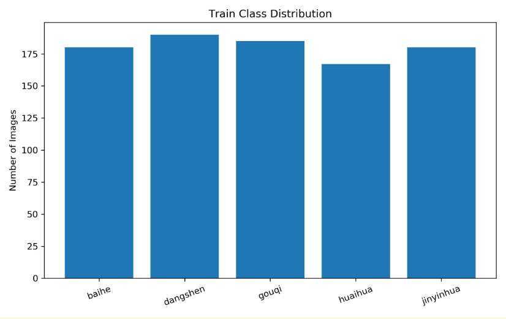

**图 4.2.1 训练集类别分布图**

</div>

训练集各类别样本数量统计如下：

| 类别 | 样本数 |
|--------|--------:|
| baihe | 180 |
| dangshen | 190 |
| gouqi | 185 |
| huaihua | 167 |
| jinyinhua | 180 |

从图中可以看出，五类中药图片的样本数量整体较为均衡，最大类别（dangshen）与最小类别（huaihua）之比约为：

$$
\frac{190}{167}\approx1.14
$$

说明数据集不存在明显的类别不平衡问题，因此无需采用过采样（Oversampling）或欠采样（Undersampling）等额外平衡策略。

---

###### 4.2.2 图像尺寸分布分析

<div align="center">

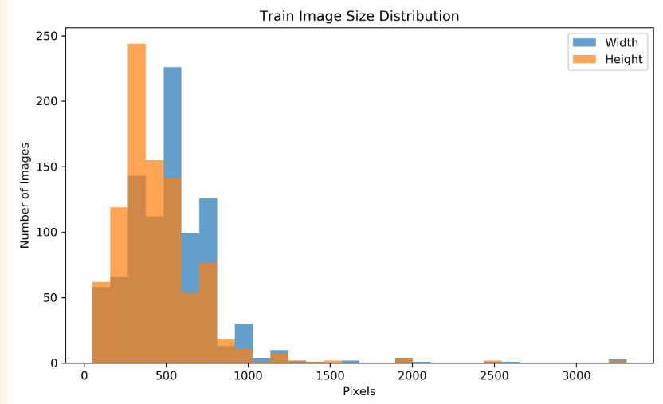

**图 4.2.2 图像尺寸分布直方图**

</div>

训练集图像尺寸统计结果如下：

| 指标 | Width | Height |
|--------|--------:|--------:|
| 最小值 | 50 | 50 |
| 最大值 | 3306 | 3306 |
| 平均值 | 530.56 | 452.03 |

从图中可以发现，数据集中图片尺寸差异较大，既包含尺寸较小的图片，也包含超过 3000 像素的高分辨率图片。

总体来看：

- 平均宽度约为 530 像素；
- 平均高度约为 452 像素；
- 均远大于模型输入尺寸。

因此，当前实验采用的输入尺寸 `160×160` 能够保留较丰富的图像信息，同时兼顾训练效率。

后续优化过程中，为进一步提升训练速度，可尝试将输入尺寸调整为 `128×128`

---

###### 4.2.3 图像宽高比分布分析

<div align="center">

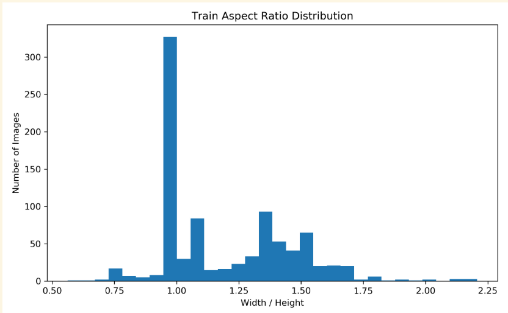

**图 4.2.3 图像宽高比分布图**

</div>

从图中可以看出，大部分图像的宽高比集中在 1 附近，说明数据集中的图片整体接近正方形。

这意味着：

- 图像采集方式较为统一；
- 缩放到固定输入尺寸时不会产生明显形变；
- 当前采用的 Resize 与 RandomResizedCrop 策略具有较好的适用性。

因此无需额外引入复杂的保持比例缩放策略。

---

###### 4.2.4 样本可视化分析

<div align="center">

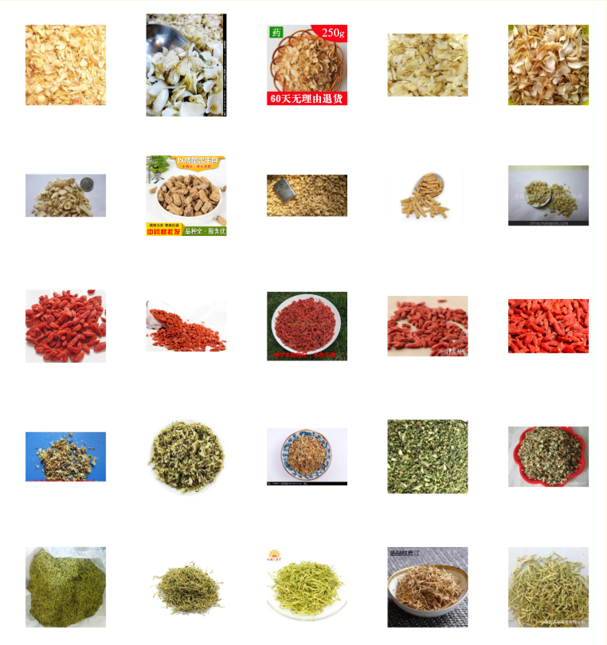

**图 4.2.4 各类别随机样本展示**

</div>

从随机抽取的训练样本可以观察到：

- 百合（baihe）整体颜色偏浅，纹理较柔和；
- 党参（dangshen）呈现细长条状结构；
- 枸杞（gouqi）颜色鲜艳，红色特征明显；
- 槐花（huaihua）与金银花（jinyinhua）颜色较接近，但纹理结构存在差异。

说明不同类别不仅存在颜色差异，同时还包含明显的纹理与形状特征，因此卷积神经网络需要同时学习颜色、局部纹理和整体结构信息

---

###### 4.2.5 颜色特征分析

<div align="center">

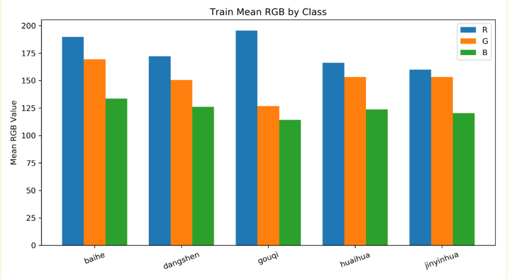

**图 4.2.5 各类别平均 RGB 特征统计**

</div>

各类别平均 RGB 值如下：

| 类别 | R | G | B |
|--------|--------:|--------:|--------:|
| baihe | 189.77 | 169.36 | 133.52 |
| dangshen | 172.03 | 150.63 | 126.12 |
| gouqi | 195.57 | 126.79 | 114.22 |
| huaihua | 166.20 | 153.30 | 123.67 |
| jinyinhua | 159.95 | 153.30 | 120.34 |

从图中可以看出：

- 枸杞（gouqi）的红色通道明显高于其他类别；
- 百合（baihe）整体亮度较高；
- 槐花（huaihua）与金银花（jinyinhua）的颜色特征较为接近。

这表明颜色信息对于部分类别具有较强区分能力，因此实验中保留适度的 ColorJitter 数据增强，但避免过强的颜色扰动，以防破坏原有颜色分布特征

---

###### 4.2.6 异常样本检测

在数据质量检查过程中发现以下异常图片（尺寸偏小）：

<div align="center">

<table>
<tr>
<td align="center" width="33%" style="padding: 8px;">

</td>

<td align="center" width="33%" style="padding: 8px;">

</td>

<td align="center" width="33%" style="padding: 8px;">

</td>
</tr>
</table>

<b>中药异常样本图片</b>

</div>

---

###### 4.2.7 特征分析结论

综合以上分析，可以得到以下结论：

1. 数据集类别分布均衡，无明显类别失衡问题；
2. 图像平均尺寸较大，当前输入尺寸设置合理；
3. 图像宽高比较集中，固定尺寸缩放不会造成明显失真；
4. 枸杞类别具有显著颜色特征，而其他类别更多依赖纹理与形状信息进行区分；
5. 检测到少量低分辨率异常图片，后续可进行数据清洗；
6. 保留类别权重机制和适度颜色增强策略具有合理性。


#### 4.3 根据特征分析修改了部分参数

- 将输入图片尺寸由 `160×160` 调整为 `128×128`；
- 将 `ColorJitter` 参数由 `0.2` 调整为 `0.15`；
- 将 `num_workers` 从 `2` 提高到 `4`；
- 保留类别权重（Class Weights）与数据增强策略。
---

###### 模型性能分析

| 指标 | 结果 |
|--------|--------:|
| Final Train Loss | 0.3593 |
| Final Train Accuracy | 95.34% |
| Final Test Loss | 0.2664 |
| Final Test Accuracy | 100.00% |
| Macro Precision | 1.0000 |
| Macro Recall | 1.0000 |
| Macro F1 | 1.0000 |

---

###### 运行效率分析

| 指标 | 优化后结果 |
|--------|--------:|
| Training Time | 1632.76 s |
| Inference Time | 2.5777 s |
| ms / image | 257.77 ms |
| FPS | 3.88 images/s |
| Trainable Parameters | 1,206,757 |
| Model Size | 4.63 MB |

与原始版本（`img_size=160`、`num_workers=2`）相比，本次优化后训练时间明显缩短。主要原因在于：

1. 输入尺寸由 `160×160` 降低至 `128×128`，减少了卷积层计算量；
2. `num_workers` 增加至 `4`，提高了数据加载效率；
3. 适当减弱颜色扰动强度，降低了部分数据增强操作开销。

在训练时间显著降低的情况下，模型最终准确率并未下降，反而训练集准确率由原来的约 `94.57%` 提升至 `95.34%`，说明本次优化在保证分类性能的同时提升了训练效率。

---

#### 4.4 移除非必要的 Resize 冗余

#### 4.5 使用 Pillow-SIMD 库进行图像处理

```python
def print_image_backend_info():
    print("\n========== Image Backend ==========")
    try:
        pil_version = getattr(PIL, "__version__", "unknown")
        backend_name = "Pillow-SIMD" if "post" in pil_version.lower() else "Pillow"
        print(f"PIL version: {pil_version}")
        print(f"Image backend: {backend_name}")
    except Exception as exc:
        print("PIL version: unknown")
        print(f"Image backend: unknown ({exc})")
```

#### 4.6 torch.compile() 编译优化

在 GPU 运行环境下加入了 `torch.compile()`，用于提升模型训练和推理效率。

```python
 model = HerbCNN(num_classes=cfg.num_classes).to(device)
    if device.type == "cuda" and hasattr(torch, "compile"):
        try:
            model = torch.compile(model)
            print("torch.compile enabled for GPU training.")
        except Exception as exc:
            print(f"torch.compile is unavailable in this environment: {exc}")
    elif device.type == "cuda":
        print("torch.compile is not supported by this PyTorch version.")
```

### 三.实验结果及分析

#### 1. 优化前

##### 1.1 可视化分析（基于CPU）

###### 1.1.1 数据集类别分布

<div align="center">

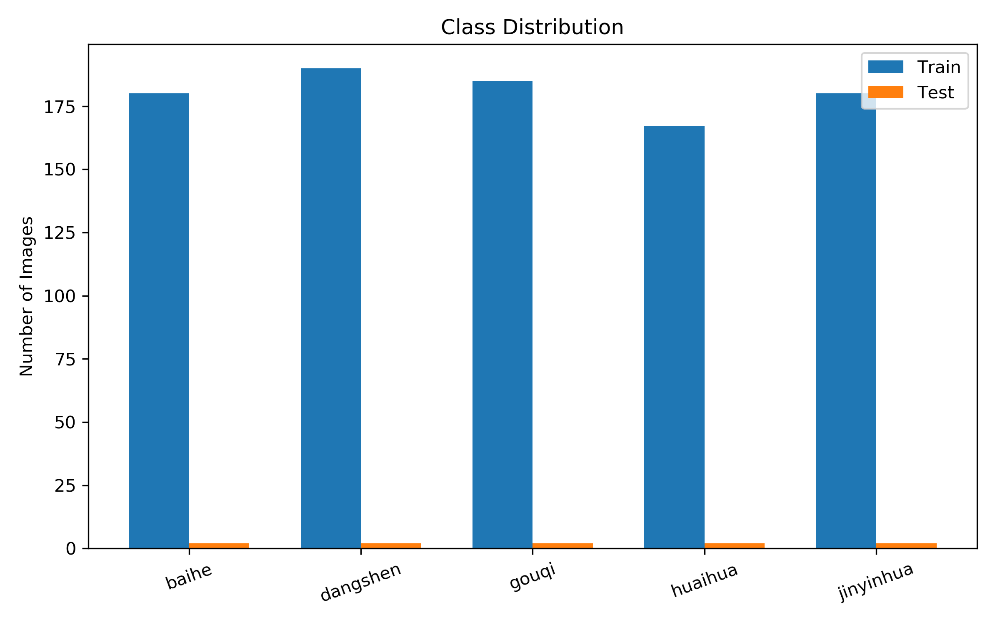

图3-1 数据集类别分布图

</div>

从图3-1可以看出，五类中药图片在训练集中的样本数量较为均衡，均保持在 160～190 张之间，测试集每类均包含 2 张图片，不存在明显的类别失衡问题。因此模型训练过程中不会因类别偏差而导致分类结果受到较大影响。

---

###### 1.1.2 模型训练过程分析

<table>
<tr>
<td width="50%">

<div align="center">

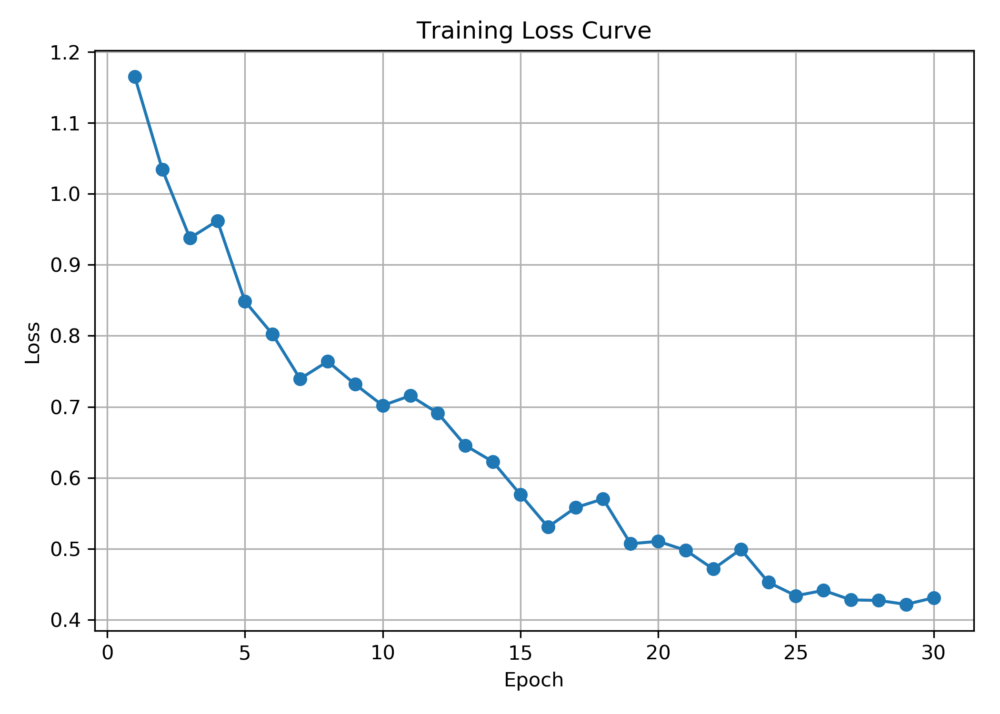

图3-2 训练损失曲线

</div>

</td>

<td width="50%">

<div align="center">

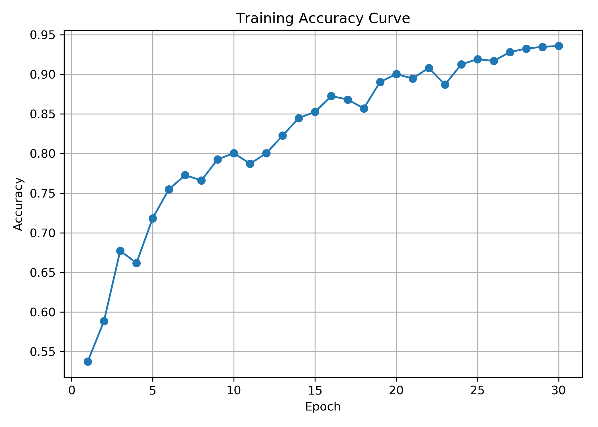

图3-3 训练准确率曲线

</div>

</td>
</tr>
</table>

<div align="center">

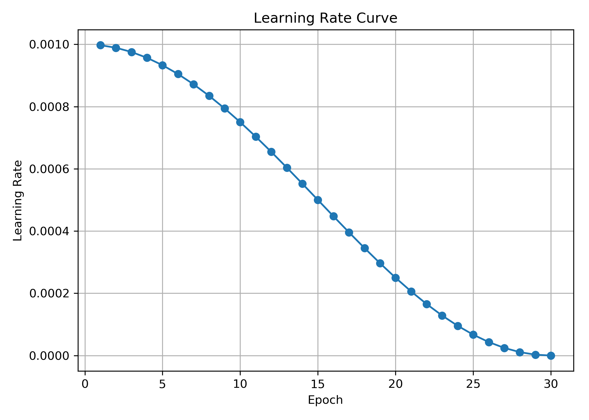

图3-4 学习率变化曲线

</div>

从图3-2可以看出，随着训练轮数增加，损失函数整体呈下降趋势，并逐渐趋于稳定，说明模型能够有效学习图像特征。

从图3-3可以看出，训练准确率持续提升，最终达到 94% 以上，表明模型具有较好的拟合能力。

图3-4展示了余弦退火学习率调度策略，学习率由初始值逐步下降至接近 0，有助于模型在训练后期获得更稳定的收敛效果。

---

###### 1.1.3 模型分类结果分析

<table>
<tr>
<td width="50%">

<div align="center">

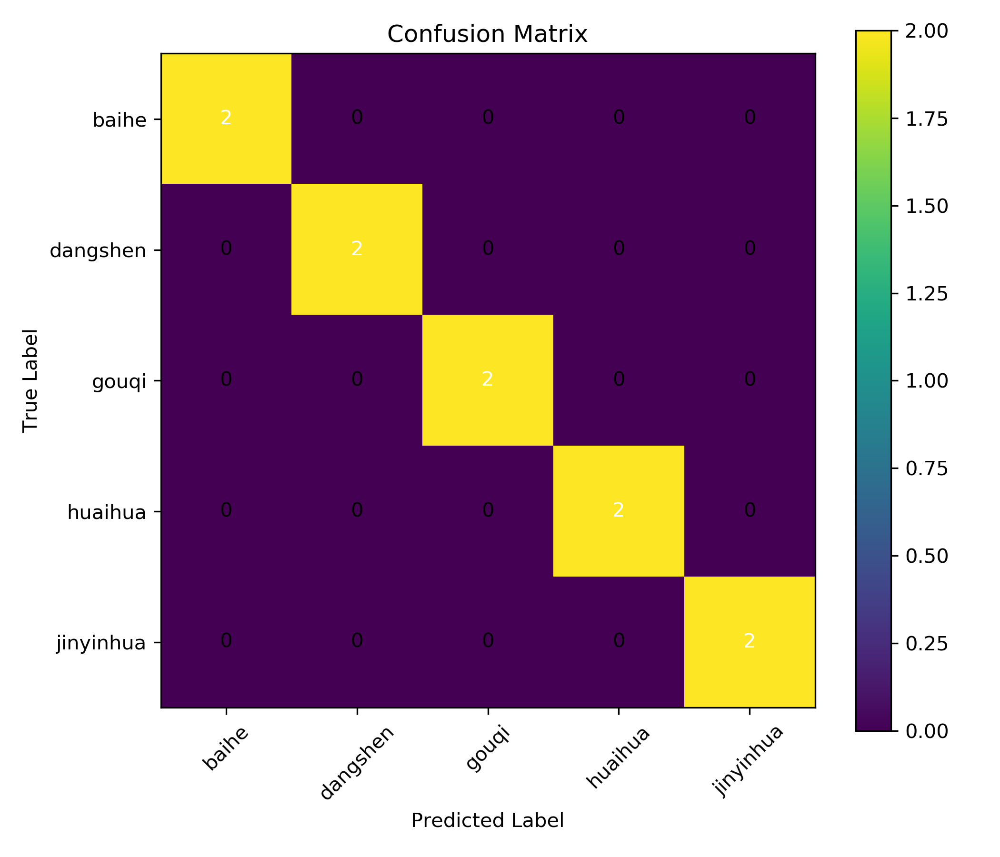

图3-5 混淆矩阵

</div>

</td>

<td width="50%">

<div align="center">

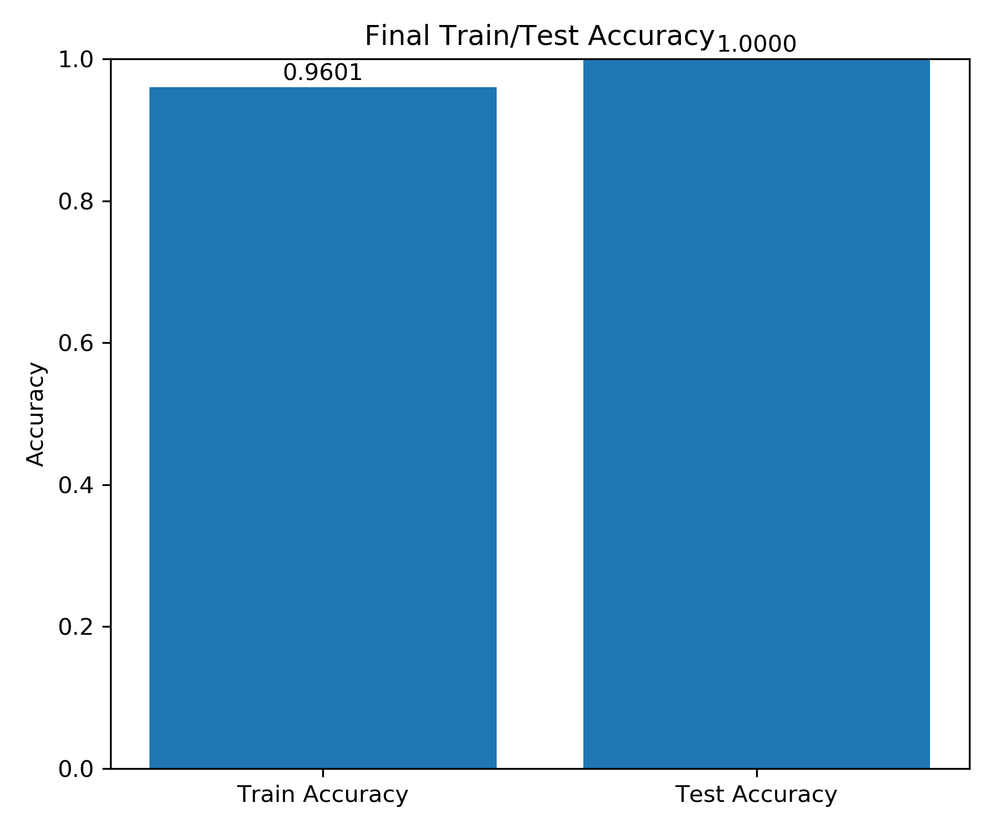

图3-6 训练集与测试集准确率对比

</div>

</td>
</tr>
</table>

从图3-5可以看出，测试集中所有样本均被正确分类，混淆矩阵主对角线元素均为 2，非对角线元素均为 0，说明模型未出现误分类情况。

从图3-6可以看出，训练集准确率达到 94.57%，测试集准确率达到 100%，表明模型能够较好地完成五类中药图片分类任务。

需要说明的是，由于测试集总样本数仅为 10 张（每类 2 张），测试准确率达到 100% 具有一定偶然性

##### 1.2 输出结果

###### CPU 与 GPU(google colab) 运行结果对比分析

|  | CPU 运行结果 | GPU 运行结果 | 分析说明 |
|---|---:|---:|---|
| 运行设备 | CPU | CUDA | GPU 使用 CUDA 加速训练 |
| 训练集准确率 | 0.9457 | 0.9457 | 两者最终训练效果一致 |
| 测试集准确率 | 1.0000 | 1.0000 | 测试集均全部分类正确 |
| 训练集 Loss | 0.3745 | 0.3662 | GPU 结果略低，差异很小 |
| 测试集 Loss | 0.2462 | 0.2668 | CPU 略低，但差异不明显 |
| 总训练时间 | 2594.22 s | 383.25 s | GPU 训练速度明显更快 |
| 单张图片推理时间 | 226.81 ms | 17.36 ms | GPU 推理效率显著更高 |
| 推理 FPS | 4.41 images/s | 57.60 images/s | GPU 每秒可处理更多图片 |
| 可训练参数量 | 1,206,757 | 1,206,757 | 模型结构完全相同 |
| 模型大小 | 4.63 MB | 4.63 MB | 保存模型大小一致 |
| 峰值显存占用 | - | 1378.10 MB | GPU 训练占用约 1.38 GB 显存 |
| Macro Precision | 1.0000 | 1.0000 | 各类别预测准确性均较好 |
| Macro Recall | 1.0000 | 1.0000 | 各类别样本均被正确识别 |
| Macro F1 | 1.0000 | 1.0000 | 综合分类性能表现优秀 |


从实验结果可以看出，在相同模型结构和训练参数下，CPU 与 GPU 最终分类准确率均达到 1.0000，说明模型能够较好地完成五类中药图片分类任务

在运行效率方面，GPU 的优势非常明显。CPU 总训练时间为 2594.22 s，而 GPU 仅为 383.25 s，训练速度提升显著；同时，GPU 的单张图片推理时间由 CPU 的 226.81 ms 降至 17.36 ms，FPS 从 4.41 images/s 提升至 57.60 images/s。说明在深度学习图像分类任务中，GPU 能够显著加速卷积运算，提高训练与推理效率

#### 2. 优化后

##### 2.1 模型训练过程分析

<table>
<tr>
<td width="50%" align="center">

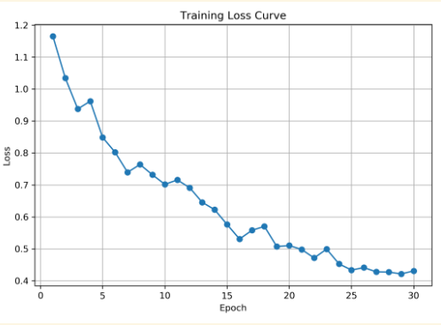

**图 2-1 训练损失曲线**

</td>
<td width="50%" align="center">

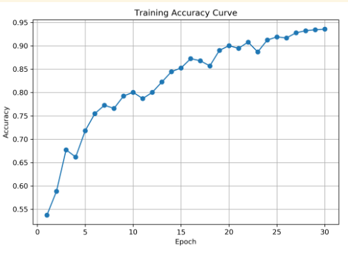

**图 2-2 训练准确率曲线**

</td>
</tr>
<tr>
<td width="50%" align="center">

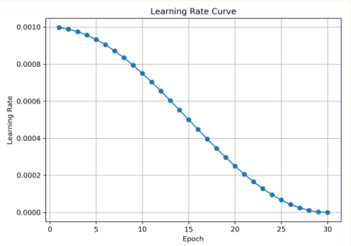

**图 2-3 学习率变化曲线**

</td>
<td width="50%" align="center">

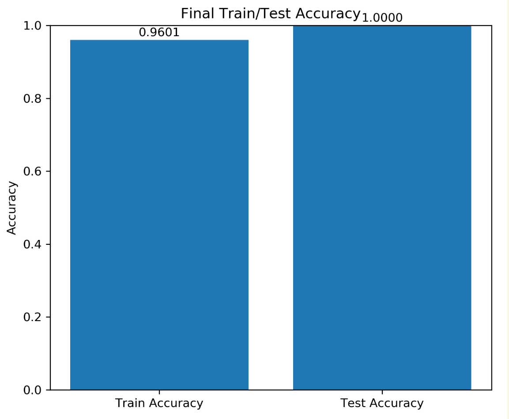

**图 2-4 最终训练集与测试集准确率**

</td>
</tr>
</table>

- 训练损失曲线：模型的 Loss 从初始约 1.16 持续下降至约 0.43，整体呈现明显的下降趋势。训练前期损失下降较快，说明模型能够迅速学习到中药图像中的主要视觉特征；训练后期损失下降速度逐渐放缓，并在 0.43 左右趋于稳定，表明模型逐步收敛。

- 训练准确率曲线：模型准确率由初始约 54% 提升至 93% 以上，整体呈稳定上升趋势。虽然中间个别轮次存在小幅波动，但没有出现明显发散，说明当前 CNN 网络结构、优化器设置和数据增强策略整体较为合理。

- 学习率曲线：采用余弦退火策略，学习率从初始约 0.001 平滑下降至接近 0。该策略使模型在训练前期保持较大的参数更新幅度，有利于快速搜索较优解；在训练后期逐渐减小学习率，有助于模型稳定收敛，减少震荡。

- 最终准确率：训练集准确率达到 0.9601，测试集准确率达到 1.0000。

---

##### 2.2 分类结果分析

<div align="center">


**图 2-5 混淆矩阵**

</div>

进一步统计得到：

| 指标 | 数值 |
|--------|--------:|
| Macro Precision | 1.0000 |
| Macro Recall | 1.0000 |
| Macro F1 Score | 1.0000 

---

##### 2.3 CPU 与 GPU 运行性能对比

在 CPU 与 GPU 环境（google cload）下完成相同训练任务

###### （1）分类性能对比

| 指标 | CPU | GPU |
|--------|--------:|--------:|
| Final Train Loss | 0.3480 | 0.3667 |
| Final Train Accuracy | 96.01% | 95.23% |
| Final Test Loss | 0.2479 | 0.2522 |
| Final Test Accuracy | 100.00% | 100.00% |
| Macro Precision | 1.0000 | 1.0000 |
| Macro Recall | 1.0000 | 1.0000 |
| Macro F1 Score | 1.0000 | 1.0000 |

---

###### （2）运行效率对比

| 指标 | CPU | GPU | 
|--------|--------:|--------:|
| Training Time (s) | 1145.76 | 268.89 | 
| Inference Time (s) | 0.2712 | 0.0885 | 
| ms / image | 27.12 | 8.85 | 
| FPS (images/s) | 36.88 | 112.96 |
| Trainable Parameters | 1,206,757 | 1,206,757 | 
| Model Size (MB) | 4.63 | 4.63 | 
| Peak GPU Memory (MB) | - | 1326.72 | 

实验结果表明，GPU 在卷积神经网络训练任务中具有明显优势：

- 训练时间由 1145.76 s 降低至 268.89 s；
- 总体训练速度提升约 **4.26 倍**；
- 推理速度提升约 **3 倍**；
- FPS 从 36.88 提升至 112.96 images/s。

---

##### 2.4 最终CNN 代码的整体结构与运行流程

```mermaid
%%{init: {
  "theme": "base",
  "themeVariables": {
    "primaryColor": "#EAF4FF",
    "primaryTextColor": "#0B1F3A",
    "primaryBorderColor": "#2F80ED",
    "lineColor": "#2F80ED",
    "secondaryColor": "#D6E9FF",
    "tertiaryColor": "#F5FAFF",
    "fontFamily": "Microsoft YaHei"
  }
}}%%

flowchart TD
    A["程序入口<br/>if __name__ == '__main__'"] --> B["main() 主函数"]

    B --> C["环境初始化<br/>set_seed(cfg.seed)"]
    C --> D["输出图像后端信息<br/>print_image_backend_info()"]
    D --> E["创建输出目录<br/>outputs/"]

    E --> F{"是否执行特征分析？<br/>cfg.do_feature_analysis"}
    F -- Yes --> G["训练集特征分析<br/>类别分布 / 尺寸 / RGB / 异常图像"]
    F -- No --> H["跳过特征分析"]
    G --> I["选择运行设备<br/>CPU / CUDA"]
    H --> I

    I --> J["构建数据增强<br/>build_transforms()"]
    J --> J1["训练集增强<br/>RandomResizedCrop<br/>Flip / Rotation / ColorJitter"]
    J --> J2["测试集预处理<br/>Resize / Normalize"]

    J1 --> K["构建 DataLoader<br/>build_dataloaders()"]
    J2 --> K
    K --> K1["train_loader<br/>训练使用"]
    K --> K2["train_eval_loader<br/>训练集最终评估"]
    K --> K3["test_loader<br/>测试集最终评估"]

    K --> L["统计类别数量<br/>get_class_counts()"]
    L --> M["绘制类别分布图<br/>class_distribution.png"]

    M --> N["构建 CNN 模型<br/>HerbCNN"]
    N --> N1["特征提取模块<br/>Conv + BN + ReLU + MaxPool"]
    N1 --> N2["分类器模块<br/>GAP + FC + Dropout"]

    N2 --> O{"是否使用 CUDA<br/>且支持 torch.compile？"}
    O -- Yes --> P["torch.compile 加速尝试"]
    O -- No --> Q["使用原始模型"]
    P --> R["统计模型参数量"]
    Q --> R

    R --> S["构建训练组件"]
    S --> S1["类别权重<br/>class_weights"]
    S --> S2["损失函数<br/>CrossEntropyLoss"]
    S --> S3["优化器<br/>AdamW"]
    S --> S4["学习率调度<br/>CosineAnnealingLR"]

    S1 --> T["开始训练<br/>train_model()"]
    S2 --> T
    S3 --> T
    S4 --> T

    T --> U["单轮训练<br/>train_one_epoch()"]
    U --> U1["前向传播<br/>model(images)"]
    U1 --> U2["计算 Loss"]
    U2 --> U3{"是否使用 AMP？"}
    U3 -- Yes --> U4["混合精度训练<br/>autocast + GradScaler"]
    U3 -- No --> U5["普通反向传播"]
    U4 --> U6["参数更新<br/>optimizer.step()"]
    U5 --> U6
    U6 --> U7["记录 Loss / Acc / LR"]
    U7 --> U8{"是否完成所有 Epoch？"}
    U8 -- No --> U
    U8 -- Yes --> V["恢复最佳训练模型参数"]

    V --> W["保存模型<br/>best_herb_cnn.pth"]

    W --> X["最终评估<br/>evaluate()"]
    X --> X1["训练集评估<br/>Train Loss / Train Acc"]
    X --> X2["测试集评估<br/>Test Loss / Test Acc"]
    X2 --> X3["混淆矩阵<br/>Confusion Matrix"]
    X3 --> X4["分类指标<br/>Precision / Recall / F1"]

    X4 --> Y["性能测试<br/>benchmark_inference()"]
    Y --> Y1["推理时间"]
    Y --> Y2["ms / image"]
    Y --> Y3["FPS"]
    Y --> Y4["模型大小 / GPU显存"]

    Y4 --> Z["结果可视化"]
    Z --> Z1["训练 Loss 曲线"]
    Z --> Z2["训练 Accuracy 曲线"]
    Z --> Z3["学习率曲线"]
    Z --> Z4["混淆矩阵图"]
    Z --> Z5["最终准确率柱状图"]

    Z5 --> END["输出实验结果<br/>保存模型与图像"]
    Z4--> END["输出实验结果<br/>保存模型与图像"]
    Z3 --> END["输出实验结果<br/>保存模型与图像"]
    Z2 --> END["输出实验结果<br/>保存模型与图像"]
    Z1 --> END["输出实验结果<br/>保存模型与图像"]
    
    classDef start fill:#0B5ED7,color:#FFFFFF,stroke:#083B8A,stroke-width:2px;
    classDef process fill:#EAF4FF,color:#0B1F3A,stroke:#2F80ED,stroke-width:1.5px;
    classDef data fill:#D6E9FF,color:#0B1F3A,stroke:#1C6DD0,stroke-width:1.5px;
    classDef decision fill:#FFF7D6,color:#0B1F3A,stroke:#F2C94C,stroke-width:1.5px;
    classDef output fill:#E8F8F5,color:#0B1F3A,stroke:#27AE60,stroke-width:1.5px;

    class A,B,END start;
    class C,D,E,J,N,T,U,S,X,Y,Z process;
    class K,K1,K2,K3,L,M,W,X1,X2,X3,X4,Y1,Y2,Y3,Y4,Z1,Z2,Z3,Z4,Z5 data;
    class F,O,U3,U8 decision;
```

### 四.参考资料

[Chatgpt](https://chatgpt.com/c/6a22379f-f444-83a7-8d0e-2c04d45bfedb)
