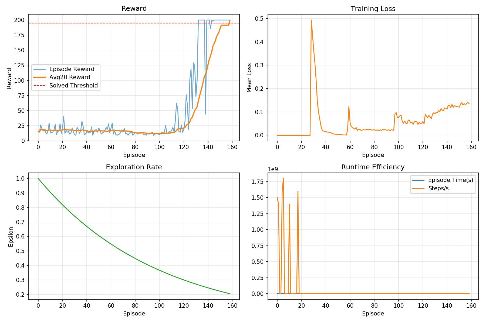
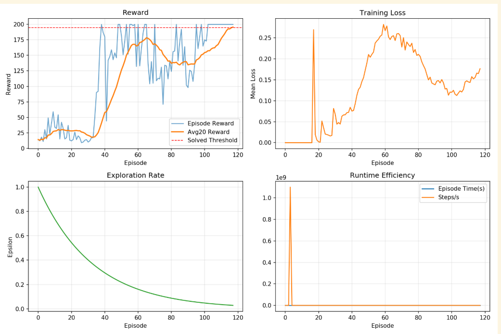

# 人工智能实验报告——强化学习

姓名:陶昕璨  学号:24325242

### 一.实验题目

###### DQN算法

在 `CartPole-v0`环境中实现DQN算法。最终算法性能的评判标准：以算法收敛的reward大小、收敛所需的样本数量给分。 reward越高（至少是180，最大是200）、收敛所需样本数量越少，分数越高。 环境及代码模板已在 `DQN`文件夹中提供。


### 二.实验内容

###### 代码运行：
默认PER
```text
python main.py --train_dqn True
```
均匀采样
```text
python main.py --train_dqn True --replay_type uniform
``` 

#### 1.算法原理

##### 1.1 DQN算法基本思想

`DQN`是将传统 `Q-Learning` 与深度神经网络结合的一种强化学习算法。传统 Q-Learning 通常使用 Q 表记录每个状态—动作对的价值，但当状态空间较大或状态连续时，Q 表难以存储和更新。因此，DQN **使用神经网络近似动作价值函数**：

$
Q(s,a;\theta)
$

其中
- `s` 表示当前状态
- `a` 表示动作
- $\theta$ 表示当前 Q 网络的参数

对于 CartPole-v0 环境，状态由小车位置、小车速度、杆子角度、杆子角速度四个连续变量组成，因此输入维度为 4；动作空间包括向左推和向右推两个动作，因此输出维度为 2。

在本实验中，Q 网络采用多层全连接神经网络结构：

$$
s \rightarrow Linear \rightarrow ReLU \rightarrow Linear \rightarrow ReLU \rightarrow Q(s,a)
$$

**网络输出**为当前状态下两个动作对应的 Q 值：

$$
Q(s,\text{left}),\quad Q(s,\text{right})
$$

智能体在**决策时**选择 Q 值较大的动作：

$$
a=\arg\max_a Q(s,a;\theta)
$$

---

##### 1.2 贝尔曼最优方程与DQN更新目标

Q-Learning 的核心依据是**贝尔曼最优方程**：

$$
Q(s,a)=r+\gamma \max_{a'} Q(s',a')
$$

其中：

| 符号       | 含义           |
| -------- | ------------ |
| `s`      | 当前状态         |
| `a`      | 当前动作         |
| `r`      | 执行动作后获得的即时奖励 |
| `s'`     | 下一状态         |
| `a'`     | 下一状态下的可选动作   |
| $\gamma$ | 折扣因子         |

在 DQN 中，使用神经网络近似 (Q(s,a))。训练时构造目标值：

$$
y = r+\gamma \max_{a'} Q(s',a';\theta^-)
$$

其中，$\theta^-$ 表示目标网络参数。当前网络预测值为：

$$
Q(s,a;\theta)
$$

因此，网络训练的目标是使当前 Q 网络输出接近目标 Q 值。

---

##### 1.3 双网络结构：当前Q网络与目标Q网络

本实验采用 DQN 中常见的双网络结构，包括：

1. 当前 Q 网络 `policy_net`:负责动作选择和参数更新
2. 目标 Q 网络 `target_net`:计算目标 Q 值

在初始化时，两个网络参数保持一致：

$$
\theta^- \leftarrow \theta
$$

```python
self.target_net.load_state_dict(self.policy_net.state_dict())
```

训练过程中，
- 当前 Q 网络每次通过反向传播更新参数
- 目标网络并不直接参与梯度更新: 代码中采用 `Hard Update` 策略，即每隔固定步数将当前 Q 网络参数复制给目标网络

这种方式可以避免目标 Q 值随着当前网络频繁变化而剧烈波动，从而提高训练稳定性。

---

##### 1.4 Double DQN目标值计算

标准 DQN 在计算目标 Q 值时使用：

$$
y = r+\gamma \max_{a'} Q(s',a';\theta^-)
$$

这种做法直接使用目标网络选取最大 Q 值，容易造成 **Q 值高估**

`Double DQN` 将“动作选择”和“动作评价”分离：

首先，使用**当前 Q 网络选择下一状态下的最优动作**：

$$
a^*=\arg\max_{a'}Q(s',a';\theta)
$$

然后，使用**目标网络评估该动作的 Q 值**：

$$
Q(s',a^*;\theta^-)
$$

最终目标值为：

$$
y = r+\gamma Q(s',a^*;\theta^-)(1-done)
$$

其中，`done` 表示当前回合是否结束。当 `done=1` 时，说明已经到达终止状态，此时不再考虑未来奖励：

$$
y=r
$$

当 (done=0) 时，继续累积未来折扣奖励：

$$
y=r+\gamma Q(s',a^*;\theta^-)
$$

这种设计可以减少 Q 值过高估计的问题，使训练过程更加稳定。

---

##### 1.5 经验回放机制

强化学习中，智能体与环境连续交互得到的样本具有**较强的时间相关性**。如果直接使用连续样本训练神经网络，容易导致训练不稳定。因此，本实验使用经验回放机制，将每一步交互产生的转移样本存入经验池：

$$
(s,a,r,s',done)
$$

其中：

| 元素     | 含义       |
| ------ | -------- |
| `s`    | 当前状态     |
| `a`    | 当前动作     |
| `r`    | 即时奖励     |
| `s'`   | 下一状态     |
| `done` | 是否到达终止状态 |

==普通经验回放==采用均匀随机采样方式，即每条经验被采样的概率相同：

$$
P(i)=\frac{1}{N}
$$

其中，`N` 为经验池中当前样本总数。均匀采样可以打破样本之间的连续相关性，提高训练稳定性。

---

##### 1.6 优先经验回放PER

在普通经验回放中，每条样本被采样的概率相同，但不同样本对网络训练的重要性并不一致。若某条样本的 TD Error 较大，说明当前网络**对该样本预测误差较大，更值得被优先学习**。因此，本实验实现了优先经验回放机制 `PER（Prioritized Experience Replay）`

1. `TD Error` 定义为：

$$
\delta_i = y_i - Q(s_i,a_i;\theta)
$$

2. **样本优先级**定义为：

$$
p_i = |\delta_i|+\varepsilon
$$

其中，$\varepsilon$ 是一个很小的正数，用于避免优先级为 0

3. PER 根据优先级计算**采样概率**：

$$
P(i)=\frac{p_i^\alpha}{\sum_k p_k^\alpha}
$$

其中，$\alpha$ 控制优先采样的程度：

* 当 $\alpha=0$ 时，PER 退化为均匀随机采样；
* 当 $\alpha$ 越大时，TD Error 较大的样本越容易被采样。

4. 由于 PER 改变了样本的采样分布，会引入一定偏差，因此需要**使用重要性采样权重**进行修正：

$$
w_i = \left(N \cdot P(i)\right)^{-\beta}
$$

5. 为了防止权重过大，通常进行**归一化**：

$$
w_i = \frac{w_i}{\max_j w_j}
$$

其中，$\beta$ 控制偏差修正程度。在训练前期，$\beta$ 较小，允许模型更多关注高 `TD Error` 样本；训练后期，$\beta$ 逐渐增大到 1，使更新更加无偏。

本实验中，代码根据参数 `replay_type` 选择经验回放方式：

```text
replay_type = "uniform"：使用均匀经验回放
replay_type = "per"：使用优先经验回放
```

---

##### 1.7 损失函数：Huber Loss

在强化学习训练初期，TD Error 可能较大，使用 MSE 容易造成梯度过大，使训练不稳定。

因此，本实验采用 `Huber Loss`，即 PyTorch 中的 `SmoothL1Loss`。

Huber Loss 定义为：

$$
L(\delta)=
\begin{cases}
\frac{1}{2}\delta^2, & |\delta| < 1 \
|\delta|-\frac{1}{2}, & |\delta| \ge 1
\end{cases}
$$

其中：

$$
\delta = y-Q(s,a;\theta)
$$

- 当误差较小时，Huber Loss 类似 MSE，有利于精细优化
- 当误差较大时，Huber Loss 类似 MAE，可以降低异常 TD Error 对训练的影响，从而提高训练稳定性。

在使用 `PER` 时，损失函数还需要乘以重要性采样权重：

$$
L = \frac{1}{B}\sum_{i=1}^{B} w_i L_i
$$

其中，`B` 为 batch size，`w_i` 为第 i 个样本的重要性采样权重。

对于均匀采样，则直接计算平均损失：

$$
L = \frac{1}{B}\sum_{i=1}^{B} L_i
$$

---

##### 1.8 ε-greedy探索策略

在训练过程中，智能体需要平衡探索与利用。本实验采用 `ε-greedy` 策略选择动作：

$$
a=
\begin{cases}
\text{random action}, & rand < \varepsilon \
\arg\max_a Q(s,a;\theta), & rand \ge \varepsilon
\end{cases}
$$

其中，$\varepsilon$ 表示随机探索概率。训练初期，$\varepsilon$ 较大，智能体更多地随机探索环境；训练后期，$\varepsilon$ 逐渐减小，智能体更多地依据 Q 网络选择最优动作。

本实验采用==指数衰减方式==更新 $\varepsilon$：

$$
\varepsilon = \max(\varepsilon_{min},\varepsilon \times decay)
$$

其中，$\varepsilon_{min}$ 是最小探索率，`decay` 是衰减系数。该策略可以使智能体前期充分探索，后期逐渐稳定利用已学习到的策略。

---

##### 1.9 Warm-up机制与梯度裁剪

为了避免经验池样本数量过少时直接训练导致模型学习到片面的经验，本实验加入 `Warm-up` 机制。即当经验池中的样本数量小于指定阈值时，不进行网络更新：

$$
|\mathcal{D}| < N_{warmup}
$$

其中，
- $\mathcal{D}$ 表示经验池
- $N_{warmup}$ 表示开始训练所需的最小样本数。

此外，为了防止训练过程中梯度过大，本实验加入==梯度裁剪==。若梯度范数超过设定阈值，则进行缩放：

$$
|\nabla_\theta L| \leq c
$$

其中，`c` 为最大梯度范数。梯度裁剪可以提高训练稳定性，减少网络参数更新过大导致的 `reward` 波动。

---

##### 1.10 收敛判断方法

CartPole-v0 中每存活一个时间步通常获得 1 分奖励，单局最高 reward 为 200。本实验记录每个 episode 的总奖励，并计算最近若干回合的平均奖励：

$$
AvgReward = \frac{1}{K}\sum_{i=t-K+1}^{t}R_i
$$

其中，$K$为统计窗口大小，$R_i$ 为第 i 个 episode 的总奖励。

当最近 K 个 episode 的平均 reward 达到设定阈值，并且连续若干次保持在阈值以上时，认为模型达到收敛条件：

$$
AvgReward \geq R_{solved}
$$

#### 2.关键代码展示

##### 基础可运行

```text
DQN
+ Uniform Replay
+ Target Network
+ ε-greedy
+ Huber Loss
+ Adam
```

(1) Q网络构建

```python
# 神经网络模型Q(s,a)
class QNetwork(nn.Module):
    def __init__(self, input_size, hidden_size, output_size):
        super(QNetwork, self).__init__()
        # 三层全连接 MLP
        self.net = nn.Sequential(
            nn.Linear(input_size, hidden_size),
            nn.ReLU(),
            nn.Linear(hidden_size, hidden_size),
            nn.ReLU(),
            nn.Linear(hidden_size, output_size)
        )

    def forward(self, inputs):
        return self.net(inputs)
```

输入状态：

```python
state = [x, x_dot, theta, theta_dot]
```

```python
[
 Q(s,left),
 Q(s,right)
]
```

智能体通过选择最大Q值对应的动作完成决策：

$a=Q(s,a)$

---

(2) 经验放回池

```python
# 经验放回池
class ReplayBuffer:
    def __init__(self, buffer_size):
        self.buffer_size = buffer_size
        self.buffer = []
        self.position = 0 # 循环写入指针

    def __len__(self):
        return len(self.buffer)

    # 存入经验(s,a,r,s′,done)
    def push(self, *transition):
        if len(self.buffer) < self.buffer_size:
            self.buffer.append(None)

        self.buffer[self.position] = transition
        self.position = (self.position + 1) % self.buffer_size

    # 随机采样
    def sample(self, batch_size):
        batch = random.sample(self.buffer, batch_size)
        states, actions, rewards, next_states, dones = zip(*batch)
        # 转为numpy数组，方便后续转tensor
        return (
            np.array(states, dtype=np.float32),
            np.array(actions, dtype=np.int64),
            np.array(rewards, dtype=np.float32),
            np.array(next_states, dtype=np.float32),
            np.array(dones, dtype=np.float32)
        )
    
    def clean(self):
        self.buffer = []
        self.position = 0
```

* state：当前状态；
* action：执行动作；
* reward：获得奖励；
* next_state：下一状态；
* done：回合是否结束。

训练时随机采样：
```python
batch = random.sample(
    self.buffer,
    batch_size
)
```

从而降低样本之间的相关性。

---

(3) train ( ) :DQN参数更新逻辑（类AgentDQN）

```python
def train(self):
        """
        DQN参数更新逻辑
        """
        # 检查经验池：经验少不训练
        if len(self.replay_buffer) < self.warmup_size:
            return None

        # 随机采样
        states, actions, rewards, next_states, dones = self.replay_buffer.sample(
            self.batch_size
        )

        states = torch.FloatTensor(states).to(self.device)
        actions = torch.LongTensor(actions).unsqueeze(1).to(self.device)
        rewards = torch.FloatTensor(rewards).unsqueeze(1).to(self.device)
        next_states = torch.FloatTensor(next_states).to(self.device)
        dones = torch.FloatTensor(dones).unsqueeze(1).to(self.device)

        # 计算当前Q：policy_net根据真实动作取出对应Q(s,a)
        current_q = self.policy_net(states).gather(1, actions)

        # 计算目标Q：r+γmaxQtarget​(s′)
        with torch.no_grad(): # 目标网络不计算梯度，节省显存
            next_q = self.target_net(next_states).max(1, keepdim=True)[0]
            target_q = rewards + self.gamma * next_q * (1 - dones)

        # 计算Huber损失
        loss = self.loss_fn(current_q, target_q)

        self.optimizer.zero_grad()
        loss.backward() # 反向传播
        # 梯度裁剪：防止梯度爆炸
        nn.utils.clip_grad_norm_(self.policy_net.parameters(), self.grad_norm_clip) 
        self.optimizer.step() # 更新

        if self.total_steps % self.target_update_freq == 0:
            self.target_net.load_state_dict(self.policy_net.state_dict())

        return loss.item()
```

（4） run：reset->选动作->step->存经验->训练->更新目标网络->下一步

```python
def run(self):
        """
        Implement the interaction between agent and environment here
        """
        reward_history = []

        state = self._reset_env()
        episode_reward = 0
        episode_loss = []

        # 总训练最大帧数循环
        for frame_idx in range(1, self.args.n_frames + 1):
            self.total_steps = frame_idx
            # 选动作、和环境交互
            action = self.make_action(state, test=False)
            next_state, reward, done, _ = self._step_env(action)

            self.replay_buffer.push(state, action, reward, next_state, done)

            loss = self.train()
            if loss is not None:
                episode_loss.append(loss)

            state = next_state
            episode_reward += reward

            # 当前对局结束(done=True)，统计日志、衰减epsilon
            if done:
                reward_history.append(episode_reward)
                avg_reward = np.mean(reward_history[-20:])

                mean_loss = np.mean(episode_loss) if episode_loss else 0.0

                self.writer.add_scalar("Reward/Episode", episode_reward, self.episode_count)
                self.writer.add_scalar("Reward/Avg20", avg_reward, self.episode_count)
                self.writer.add_scalar("Loss", mean_loss, self.episode_count)
                self.writer.add_scalar("Epsilon", self.epsilon, self.episode_count)

                print(
                    "Episode: {:4d} | Frame: {:6d} | Reward: {:6.1f} | Avg20: {:6.1f} | Epsilon: {:.3f} | Loss: {:.4f}".format(
                        self.episode_count,
                        frame_idx,
                        episode_reward,
                        avg_reward,
                        self.epsilon,
                        mean_loss
                    )
                )

                # epsilon衰减，逐步降低探索概率
                self.epsilon = max(
                    self.epsilon_end,
                    self.epsilon * self.epsilon_decay
                )

                state = self._reset_env()
                episode_reward = 0
                episode_loss = []
                self.episode_count += 1

                if avg_reward >= 180 and len(reward_history) >= 20:
                    print("Solved! Avg20 reward reached {:.1f}".format(avg_reward))
                    break

        self.writer.close()
```

##### 优化:DDQN+修改参数+可视化

###### 观察现象

| 现象 | 表现 |
|---|---|
| 部分回合 reward 很高 | 某些 episode 可以达到 180 甚至 200 |
| 部分回合 reward 很低 | 有些 episode 仍然只有几十分 |
| Avg20 曾经升高后又下降 | 某一阶段达到较高水平，但后续又回落 |
| 训练可能未达到收敛就结束 | `n_frames` 用完后停止，但 Avg20 未达到 180 |

---

###### 主要问题及原因分析

- 单局 reward 高不代表真正收敛

原因包括：

- `epsilon-greedy` 仍然存在随机探索；
- CartPole 初始状态具有随机性；
- DQN 训练过程中神经网络参数不断更新，策略可能暂时退化；
- ReplayBuffer 中采样的经验具有随机性；
- Target Network 周期性更新会导致目标 Q 值变化。

- 只看“平台期”会导致低分误判收敛

曾经尝试过只根据 Avg20 是否长期不提升来判断收敛，但出现了 Avg20 只有 31.7 左右时就停止的问题。

原因是：

```text
低 reward 也可能进入平台期。
```

原始代码中的探索率衰减较慢：

```python
epsilon_decay = 0.995
```
---

###### 代码修改内容

(1) 将 DQN 目标值计算改为 ==Double DQN==

普通 DQN 是直接用 target_net(next_states).max() 同时完成“选动作”和“估值”，容易高估 Q 值

Double DQN采用`policy_net` 负责选择下一步最优动作，`target_net` 负责评价这个动作的 Q 值

```python
next_q = self.target_net(next_states).max(1, keepdim=True)[0]
target_q = rewards + self.gamma * next_q * (1 - dones)
```

修改为 Double DQN：

```python
with torch.no_grad():
    # Double DQN: policy_net selects the action, target_net estimates its value.
    next_actions = self.policy_net(next_states).argmax(dim=1, keepdim=True)
    next_q = self.target_net(next_states).gather(1, next_actions)
    target_q = rewards + self.gamma * next_q * (1 - dones)
```

修改后：

- `policy_net` 负责选择下一状态的最优动作；
- `target_net` 负责估计该动作的 Q 值；
- 可以缓解普通 DQN 中 Q 值过估计的问题。

---

(2) 调整默认超参数，提高收敛效率

| 参数 | 原始值 | 修改后 | 作用 |
|---|---:|---:|---|
| `warmup_size` | 1000 | 500 | 更早开始训练，减少前期样本浪费 |
| `target_update_freq` | 200 | 100 | 更频繁同步目标网络，提高学习响应速度 |
| `epsilon_end` | 0.02 | 0.01 | 后期减少随机探索，提高策略稳定性 |
| `epsilon_decay` | 0.995 | 0.97 | 更快从探索转向利用，提高样本效率 |

修改后的代码如下：

```python
parser.add_argument("--warmup_size", default=500, type=int)
parser.add_argument("--target_update_freq", default=100, type=int)

parser.add_argument("--epsilon_end", default=0.01, type=float)
parser.add_argument("--epsilon_decay", default=0.97, type=float)
```

---

(3)  新增合理的收敛停止条件


```python
self.min_solve_score = 195.0
self.min_qualified_episodes = 10
self.min_convergence_episodes = 40
self.convergence_patience = 10
self.convergence_delta = 1.0
```

含义如下：

| 参数 | 含义 |
|---|---|
| `min_solve_score = 195.0` | Avg20 必须大于 195 才允许停止 |
| `min_qualified_episodes = 10` | Avg20 需要连续 10 个 episode 大于 180 |
| `min_convergence_episodes = 40` | 至少训练 40 个 episode 后才判断收敛 |
| `convergence_patience = 10` | 高分区间内连续 10 局没有明显提升才停止 |
| `convergence_delta = 1.0` | Avg20 提升超过 1 分才算明显提升 |

核心停止逻辑如下：

```python
if avg_reward > best_avg20 + self.convergence_delta:
    best_avg20 = avg_reward
    no_improve_episodes = 0
else:
    no_improve_episodes += 1

if avg_reward > self.min_solve_score:
    qualified_episodes += 1
else:
    qualified_episodes = 0

if avg_reward <= self.min_solve_score:
    no_improve_episodes = 0

if (
    avg_reward > self.min_solve_score
    and qualified_episodes >= self.min_qualified_episodes
    and len(reward_history) >= self.min_convergence_episodes
    and no_improve_episodes >= self.convergence_patience
):
    solved_episode = self.episode_count - 1
    solved_frame = frame_idx
    print("Converged! Avg20 is in qualified range and stayed near best value {:.1f}, current Avg20 is {:.1f}".format(
        best_avg20, avg_reward
    ))
    break
```

---

(4) 新增结果可视化与指标保存

- 每局 reward；
- 最近 20 局平均 reward；
- loss；
- epsilon；
- episode 时间；
- 每秒环境步数。

训练结束后自动保存：

```text
DQN/runs/dqn_cartpole_basic/training_metrics.csv
DQN/runs/dqn_cartpole_basic/training_analysis.png
```

可视化图表如下：



图中包含：

| 子图 | 含义 |
|---|---|
| Reward | 单局 reward 与 Avg20 reward 曲线 |
| Training Loss | 每局平均训练损失 |
| Exploration Rate | epsilon 探索率变化 |
| Runtime Efficiency | 每局耗时与运行效率 |

---

##### 再优化：PER 优先经验回放

在已有 DDQN 代码基础上加入 ==PER==（Prioritized Experience Replay，优先经验回放），并保留原来的 Uniform Replay

###### 修改内容

(1) 在 `dqn_arguments(parser)` 中新增参数：

```python
parser.add_argument("--replay_type", default="per", choices=["uniform", "per"])
parser.add_argument("--per_alpha", default=0.6, type=float)
parser.add_argument("--per_beta_start", default=0.4, type=float)
parser.add_argument("--per_beta_frames", default=30000, type=int)
parser.add_argument("--per_eps", default=1e-6, type=float)
```

参数含义如下：

| 参数 | 默认值 | 含义 |
|---|---:|---|
| `replay_type` | `per` | 选择经验回放类型 |
| `per_alpha` | 0.6 | 控制优先级影响程度，0 表示退化为均匀采样 |
| `per_beta_start` | 0.4 | 重要性采样权重 beta 初始值 |
| `per_beta_frames` | 30000 | beta 从初始值逐渐增加到 1.0 的步数 |
| `per_eps` | 1e-6 | 避免 priority 为 0 |

(2) 新增 `PrioritizedReplayBuffer`

核心代码如下：

```python
#---------------优先经验放回--------------------
# α 控制优先程度（α=0 退化为普通均匀回放），β 控制权重修正强度——抵消高频采样高优样本带来的权重偏离（训练后期逐渐升到 1）
class PrioritizedReplayBuffer:
    def __init__(self, buffer_size, alpha=0.6, eps=1e-6):
        self.buffer_size = buffer_size
        self.alpha = alpha # 优先级放大系数
        self.eps = eps # 极小值，防止TD误差为0时优先级=0，无法被采样
        self.buffer = [] 
        self.priorities = np.zeros((buffer_size,), dtype=np.float32)
        self.position = 0

    def __len__(self):
        return len(self.buffer)

    # 存入一条交互转移样本
    def push(self, *transition):
        if len(self.buffer) < self.buffer_size:
            self.buffer.append(None)

        # 获取当前池中最大优先级
        max_priority = self.priorities[:len(self.buffer)].max() if len(self.buffer) > 0 else 1.0
        if max_priority <= 0:
            max_priority = 1.0

        # 写入样本和对应优先级
        self.buffer[self.position] = transition
        self.priorities[self.position] = max_priority
        self.position = (self.position + 1) % self.buffer_size

    def sample(self, batch_size, beta=0.4):
        current_size = len(self.buffer)
        priorities = self.priorities[:current_size]
        probs = priorities ** self.alpha # 加权优先级：α调节优先强度
        probs = probs / probs.sum() # 归一化

        indices = np.random.choice(current_size, batch_size, p=probs)
        batch = [self.buffer[idx] for idx in indices]
        states, actions, rewards, next_states, dones = zip(*batch)

        # 计算重要性采样权重 IS weights
        weights = (current_size * probs[indices]) ** (-beta)
        weights = weights / weights.max() # 权重归一化到[0,1]，避免梯度爆炸

        return (
            np.array(states, dtype=np.float32),
            np.array(actions, dtype=np.int64),
            np.array(rewards, dtype=np.float32),
            np.array(next_states, dtype=np.float32),
            np.array(dones, dtype=np.float32),
            indices,
            weights.astype(np.float32)
        )

    def update_priorities(self, indices, td_errors):
        if torch.is_tensor(td_errors):
            td_errors = td_errors.detach().cpu().numpy()

        td_errors = np.asarray(td_errors).reshape(-1)
        # 优先级更新公式 p = |TD_error| + eps
        self.priorities[indices] = np.abs(td_errors) + self.eps

    def clean(self):
        self.buffer = []
        self.position = 0
        self.priorities = np.zeros((self.buffer_size,), dtype=np.float32)
```

---

(3) PER采样逻辑说明

采样概率由 priority 决定：

```python
probs = priorities ** self.alpha
probs = probs / probs.sum()
```

含义：

```text
priority 越大，被采样的概率越高。
```

其中 `alpha` 控制优先级影响程度：

| alpha | 含义 |
|---:|---|
| 0 | 退化为 Uniform Replay |
| 0.6 | 常用折中值 |
| 1 | 完全按 priority 比例采样 |

采样代码：

```python
indices = np.random.choice(current_size, batch_size, p=probs)
```

这样可以让 TD error 较大的经验更容易被训练到。

---

(4) 重要性采样权重

由于 PER 改变了样本采样分布，会引入一定偏差，因此需要使用重要性采样权重进行修正。

权重计算如下：

```python
weights = (current_size * probs[indices]) ** (-beta)
weights = weights / weights.max()
```

其中 `beta` 会随着训练逐渐增大到 1：

```python
beta = min(
    1.0,
    self.per_beta_start + self.total_steps * (1.0 - self.per_beta_start) / self.per_beta_frames
)
```

含义：

```text
训练初期 beta 较小，更强调优先采样；
训练后期 beta 接近 1，更充分修正采样偏差。
```

---
(5) AgentDQN 初始化修改

原始代码固定使用 Uniform Replay：

```python
self.replay_buffer = ReplayBuffer(args.buffer_size)
```

修改后根据 `replay_type` 选择经验池：

```python
self.replay_type = args.replay_type
self.per_beta_start = args.per_beta_start
self.per_beta_frames = args.per_beta_frames

if args.replay_type == "per":
    self.replay_buffer = PrioritizedReplayBuffer(
        args.buffer_size,
        alpha=args.per_alpha,
        eps=args.per_eps
    )
else:
    self.replay_buffer = ReplayBuffer(args.buffer_size)
```

同时，为了支持 PER 权重，Huber Loss 改为逐样本计算：

```python
self.loss_fn = nn.SmoothL1Loss(reduction="none")
```

---

(6) train () 方法修改

原来的训练流程基本保持不变，只在采样和 loss 计算部分增加 PER 分支。

- PER 采样

```python
if self.replay_type == "per":
    beta = min(
        1.0,
        self.per_beta_start + self.total_steps * (1.0 - self.per_beta_start) / self.per_beta_frames
    )

    states, actions, rewards, next_states, dones, indices, weights = self.replay_buffer.sample(
        self.batch_size,
        beta=beta
    )
else:
    states, actions, rewards, next_states, dones = self.replay_buffer.sample(
        self.batch_size
    )
```
---

(7) 加权`Huber Loss`


```python
elementwise_loss = self.loss_fn(current_q, target_q)

if self.replay_type == "per":
    loss = (weights * elementwise_loss).mean()
else:
    loss = elementwise_loss.mean()
```

```text
Uniform Replay：所有样本 loss 直接平均；
PER：每个样本 loss 乘以重要性采样权重后再平均。
```

---

(8) 更新`priority`

训练后计算 TD error：

```python
td_errors = target_q - current_q
```

优化器更新后，如果使用 PER，则更新对应样本的 priority：

```python
if self.replay_type == "per":
    self.replay_buffer.update_priorities(indices, td_errors)
```

priority 更新公式为：

```text
priority = abs(td_error) + eps
```

这样下一次采样时，TD error 较大的样本更容易被再次采样。

---

#### 3.创新点&优化

本实验最终实现的算法并非单纯的基础 DQN，而是在 DQN 框架上融合了 Double DQN、优先经验回放、加权 Huber Loss、动态探索率衰减、训练指标记录与可视化等改进。

| 序号 | 优化点 | 具体做法 | 作用 |
|---|---|---|---|
| 1 | Double DQN | 使用 `policy_net` 选择下一状态最优动作，使用 `target_net` 评估该动作价值 | 缓解普通 DQN 的 Q 值过估计问题，提高训练稳定性 |
| 2 | 优先经验回放 PER | 根据 TD Error 为样本分配 priority，高误差样本被更高概率采样 | 提高关键样本利用率，加快收敛速度 |
| 3 | 重要性采样权重 | 对 PER 采样样本加入 IS Weight 修正 | 减小 PER 改变采样分布带来的偏差 |
| 4 | 加权 Huber Loss | 使用 `SmoothL1Loss(reduction="none")`，PER 模式下乘以样本权重 | 降低大 TD Error 导致的训练震荡 |
| 5 | 指数衰减 ε-greedy | 每个 episode 后令 `epsilon = max(epsilon_end, epsilon * epsilon_decay)` | 前期充分探索，后期更快转向利用 |
| 6 | Warm-up 机制 | 经验池样本数量达到阈值后再开始训练 | 避免训练初期样本过少导致学习不稳定 |
| 7 | 梯度裁剪 | 使用 `clip_grad_norm_` 限制梯度范数 | 防止梯度爆炸，提高训练稳定性 |
| 8 | 训练指标记录 | 保存 reward、Avg20、loss、epsilon、FPS 等指标到 CSV | 便于分析训练过程和实验复现 |
| 9 | 训练曲线可视化 | 自动生成 reward、loss、epsilon、运行效率曲线 | 更直观展示模型收敛效果 |

### 三.实验结果及分析

#### 1.实验结果展示示例

###### 基础 DQN 版本

| 指标           | 数值       |
| ------------ | -------- |
| Episodes     | 476      |
| Frames       | 29961    |
| Total Time   | 123.77 s |
| Best Reward  | 200.0    |
| Mean Reward  | 62.9     |
| Final Avg20  | 70.3     |
| Mean Loss    | 0.4295   |
| Solve Status | 未达到收敛条件  |

可以看出，虽然基础 DQN 偶尔能够获得单局 Reward=200，但整体训练过程不稳定

###### 优化后



在引入 Double DQN、PER、Huber Loss、Warm-up、梯度裁剪等优化后，对不同超参数组合进行了实验。选取表现最好的 10 组结果如下表所示

| 排名 | Learning Rate | Batch Size | Target Update | Epsilon Decay | Solve | Solve Frames | Episodes | Best Reward | Final Avg20 | Best Avg20 |
| -- | ------------- | ---------- | ------------- | ------------- | ----- | -----------: | -------: | ----------: | ----------: | ---------: |
| 1  | 1e-4          | 64         | 500           | 0.99          | ✓     |     **7569** |      196 |       200.0 |       196.9 |      196.9 |
| 2  | 5e-4          | 32         | 500           | 0.99          | ✓     |         9325 |      205 |       200.0 |   **197.0** |  **197.0** |
| 3  | 1e-3          | 64         | 100           | 0.99          | ✓     |        17714 |      234 |       200.0 |       195.7 |      195.7 |
| 4  | 1e-4          | 32         | 100           | 0.995         | ✓     |        20445 |      317 |       200.0 |       196.4 |      196.4 |
| 5  | 1e-4          | 32         | 500           | 0.99          | ✓     |        20543 |      261 |       200.0 |       195.1 |      195.1 |
| 6  | 1e-4          | 32         | 100           | 0.99          | ✓     |        21295 |      353 |       200.0 |       196.2 |      196.2 |
| 7  | 5e-4          | 32         | 100           | 0.99          | ✓     |        21389 |      237 |       200.0 |       195.6 |      195.6 |
| 8  | 5e-4          | 64         | 500           | 0.99          | ✓     |        22567 |      279 |       200.0 |       195.3 |      195.3 |
| 9  | 1e-3          | 64         | 200           | 0.99          | ✓     |        24340 |      281 |       200.0 |       195.3 |      195.3 |
| 10 | 5e-4          | 64         | 100           | 0.99          | ✓     |        25057 |      252 |       200.0 |       195.6 |      195.6 |

---

#### 2.评测指标展示及分析

- 收敛速度

所有 Top-10 组合均成功达到收敛条件；
最快达到收敛条件的组合为：

| 参数                      | 数值   |
| ----------------------- | ---- |
| Learning Rate           | 1e-4 |
| Batch Size              | 64   |
| Target Update Frequency | 500  |
| Epsilon Decay           | 0.99 |

其仅使用：$7569 \text{ Frames}$

---

- Epsilon 衰减策略

实验结果显示：

```text
epsilon_decay = 0.99
```

在绝大多数实验组合中表现优于：

```text
epsilon_decay = 0.995
```

原因在于：

1. CartPole-v0 状态空间较小
2. 智能体能够较快学习到有效策略
3. 更快的 ε 衰减可以使模型更早进入利用阶段

---

- Target Network 更新频率

实验结果表明：

```text
target_update_freq = 500
```

在多个实验组合中均取得较好的表现。

例如排名前两位均采用：

```text
target_update_freq = 500
```

其原因是：

1. 较长的同步周期使目标网络更加稳定；
2. 避免目标 Q 值频繁变化；
3. 减少训练震荡。

---

- 学习率

  * 1e-4 收敛速度最快；
  * 5e-4 具有较好的稳定性；
  * 1e-3 虽然能够收敛，但整体样本效率略低。

---

### 四.参考资料
1. https://chatgpt.com/c/6a2f7076-05f0-83ee-9ff1-0937ce6a1c8f
