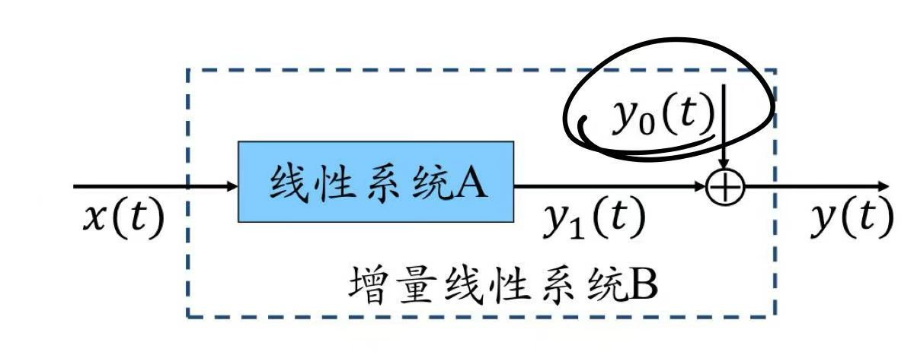

## 信号与系统
1. 任何信号都可以分解成一个偶信号和一个奇信号和
$$x(t)=x_e(t)+x_o(t)$$
其中$$x_e(t)=\frac{1}{2}[x(t)+x(-t)],x_o(t)=\frac{1}{2}[x(t)-x(-t)]$$

2. **复数的表示方法**
- 数值： $C=R+jI$
- ==极坐标：== $C=|C|(cos\theta +jsin\theta)=|C|e^{j\theta}$

3. 一个周期内内
- 能量：$T_0$
- 平均功率： $1$

*离散与连续时间类似,但是有*
a. 当$\frac{2\pi}{w_0}=\frac{N}{m}$时$e^{jw_0n}$才是周期信号
b. 当$w_0\uparrow$时信号的振荡频率会发生逆转

4. **单位冲激与阶跃**：**时域乘积取样，频域卷积取样**
$$x[n]\delta[n-m]=x[m]\delta[n-m]$$

5. **系统的基本性质(6)**
- 记忆性&无记忆性（只与当前时刻相关）
- 可逆 
- 因果性：输出只与当前时刻以及此前时刻有关
- 稳定性：有界输入$\rightarrow$有界输出
- 时不变
- 线性
  - 特：增量线性系统
    - 零输入响应
    - 零状态响应

