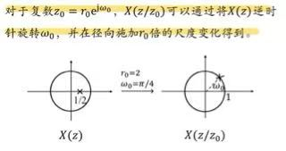

# z变换

### 双边z变换

1. 变换式
- 正变换：$X(z)=\sum^\infty_{n=-\infty}x[n]z^{-n}$,其中$z=re^{jw}$
- 反变换：$x[n]=\frac{1}{2\pi j}\oint X(z)z^{n-1}dz$
  - 泰勒级数展开法（找$z^{-n}$系数$x[n]$）
  - 长除法
    - 右边序列->降幂长除
    - 左边序列->升幂长除

### z变换收敛域

1. 收敛域**包含单位圆**则FT存在
2. 一般是z平面上以原点为中心的环形区域
3. 性质
- **有限长**序列的ROC整个平面（可能不包括$z=0/|z|=\infty$——判断收敛）
- 右边序列的ROC是某个圆的外部，但可能不包括$|z|=\infty$（如果在，则x[n]为因果序列）
- 左边序列的ROC是某个圆的内部，但可能不包括$z=0$（包括则反因果序列）

### z变换性质

1. 线性
2. 时移：$ROC:R$但是在$z=0 \& |z|=\infty$处可能增删
3. z域尺度变换：$z^n_0x[n]\Lleftarrow X(z/z_0)$,$ROC:|z_0|R$

4. 时域反转(取倒)：$x[-n]\leftrightarrow X(z^{-1})$,$ROC:1/R$
5. 时间扩展：
$$
x_k[n]=\begin{cases}x[n/k] & n为k的整数倍\\0 & 其他n \end{cases}
$$
$x_k[n]\leftrightarrow X(z^k)$，$ROC:R^{1/k}$
6. 共轭对称性：与laplace变换差不多
7. 卷积
8. z域微分：$nx[n]\leftrightarrow -z\frac{dX(z)}{dz}$
9. 初值定理：①因果 
- $x[0]=lim_{z\rightarrow \infty}X(z)$
10. 终值：①因果 ②除了$z=1$可以有一阶极点，其他极点均在单位圆内
- $lim_{n\rightarrow \infty}x[n]=lim_{z\rightarrow 1}(z-1)X(z)$

### 利用z变换分析与表征LTI系统

1. 系统特性
- 因果性
  - $H(z)$的$ROC$是最外部极点的外部，并且包括$|z|=\infty$
  - $H(z)$的分子多项式次数不能高于分母多项式
- 稳定性
  - $\sum^\infty_{n=-\infty}|h[n]|\le \infty$，也即$h[n]$的DTFT存在，则收敛域包含单位圆

### 单边z变换

1. 式子
- 正变换：$\chi(z)=\sum^\infty_{n=0}x[n]z^{-n}$
  - $ROC$最外部极点的外部，并且包含$|z|=\infty$
- 反变换：$x[n]=\frac{1}{2\pi j}\oint_c\chi(z)z^{n-1}dz,n\geq0$

2. 性质：用于求解具有初值的差分方程
- $x[n-1]\leftrightarrow z^{-1}\chi(z)+x[-1]$
- $x[n+1]\leftrightarrow z\chi(z)-zx[0]$
- $x[n-2]\leftrightarrow z^{-2}\chi(z)+z^{-1}x[-1]+x[-2]$
- $x[n+2]\leftrightarrow z^2\chi(z)-z^2x[0]-zx[1]$

### ==常见例子==

1. $x[n]=a^nu[n]\leftrightarrow X(z)=\frac{1}{1-az^{-1}}$，$ROC：|z|>|a|$
2. $x[n]=-a^nu[-n-1]\leftrightarrow X(z)=\frac{1}{1-az^{-1}}$,$ROC: |z|<|a|$
3. $a^{-n}u[-n-1]\leftrightarrow -\frac{1}{1-a^{-1}z{-1}}$,$ROC:|z|<a^{-1}$
4. **等比序列求和**